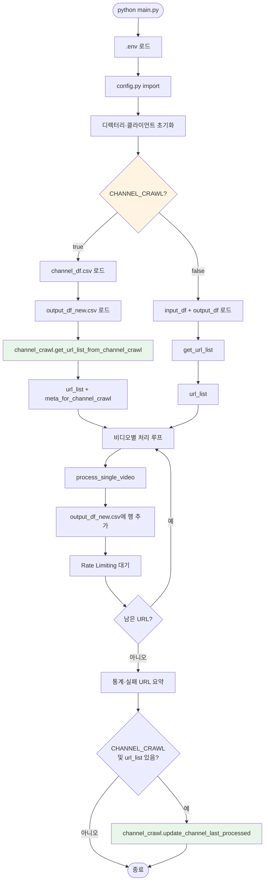
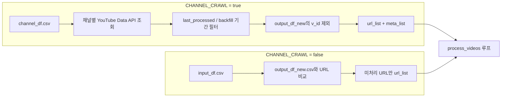
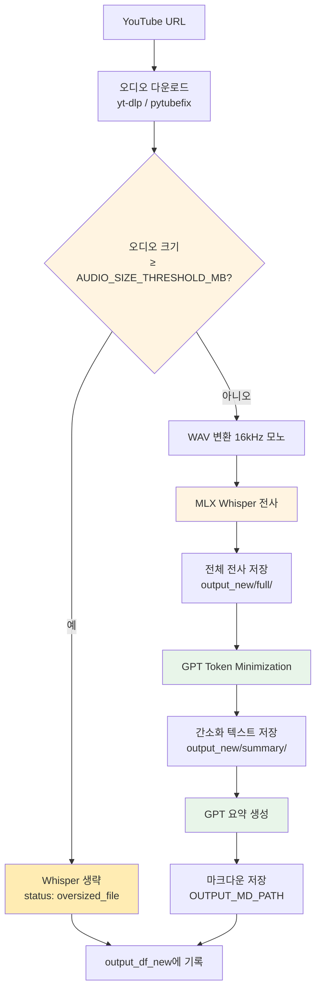
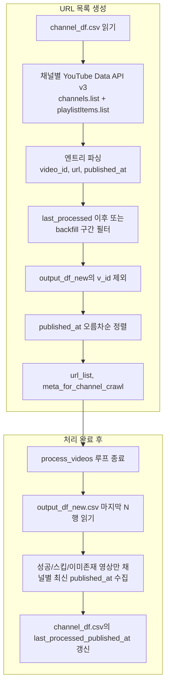
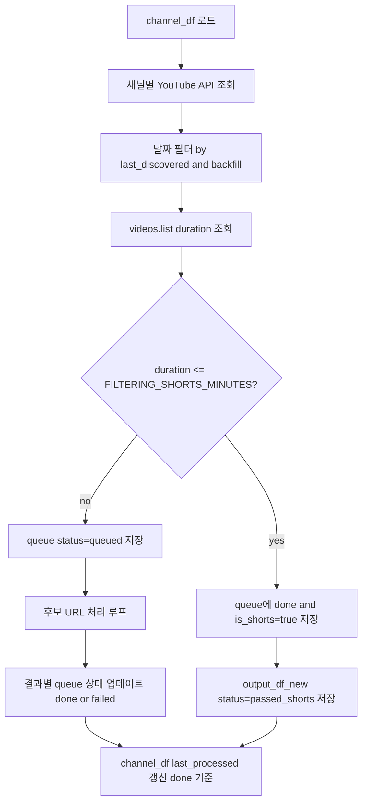
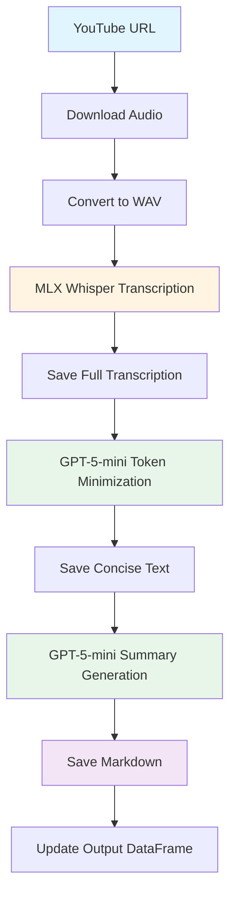

# Speech-to-Text v4.1 프로젝트 문서

## 프로젝트 개요

Speech-to-Text v4.1은 YouTube 비디오의 오디오를 다운로드하고, 음성을 텍스트로 변환한 후, AI를 활용하여 요약 및 재구성하여 **Obsidian 모바일 친화 마크다운**으로 저장하는 자동화 파이프라인입니다.

### v4 Mobile Obsidian (Phase 0 ~ 1c)

| Phase | 내용 | LLM |
|-------|------|-----|
| 0 | `note_catalog.jsonl`, audit, `digest/` | $0 |
| 1.5 | 30일 frontmatter backfill | $0 |
| 1a/1b | mobile MD v2 prompt, YAML 4.1, daily digest | +$6~8/월 |
| 1c | nano retention (auto_subs 60~80%) | −$3.5~5/월 |

상세: [UPDATE_LOG_v4_mobile_catalog.md](UPDATE_LOG_v4_mobile_catalog.md)

**볼트 혼합 상태 (정상):** 구 `_5-mini` (frontmatter 없음) · Phase 1.5 (`4.0` YAML only) · 신규 `_dS4f` (`4.1` 풀포맷). Obsidian은 혼재 OK.

### 주요 기능

1. **YouTube 비디오 다운로드**: yt-dlp를 우선 사용 (권장), pytubefix는 대체 옵션
   - **음질 최적화**: Whisper MLX용 128kbps 오디오 다운로드 (용량 절약, 품질 유지)
2. **음성 전사**: MLX Whisper 모델을 사용한 고품질 음성-텍스트 변환
   - Whisper는 16kHz 모노로 리샘플링하므로 원본 비트레이트가 높아도 전사 품질에 영향 없음
   - **자막 우선 전사**: 전사 소스 우선순위 — 업로더 자막 → (없거나 실패 시) YouTube 자동 자막(`YOUTUBE_AUTO_SCRIPT=true`) → 오디오+Whisper. `YT_DOWNLOAD_IF_SUBS_Y`로 비디오 다운로드 여부 제어. 자막 언어는 `YOUTUBE_SUBS_LANGS`(예: `en,ko,jp,en-US,en-GB`)로 설정. **자동 자막(live caption)**: 영상 주 언어를 `info.automatic_captions` 또는 `default_audio_lang`로 결정 후 해당 언어 1개만 다운로드(용량 절감).
- **파일명 규칙**: 출력 파일명에는 항상 `video_id`(VID)가 포함됨. 형식: `{sanitized_title}_{video_id}_{lang}_subs.txt` 또는 `{sanitized_title}_{video_id}_{lang}_auto_subs.txt`. `FILENAME_MAX_LENGTH`(config)로 제목 최대 길이 제어.
3. **텍스트 요약**: GPT-5-nano 전처리 (Phase 1c: auto_subs retention 60~80%) + **메인 LLM** (기본: DeepSeek V4 Flash / OpenRouter, optional fallback). MD suffix `_dS4f`, frontmatter `format_version: 4.1`. 상세: [UPDATE_LOG_20260628.md](UPDATE_LOG_20260628.md), [UPDATE_LOG_20260629_llm_fallback.md](UPDATE_LOG_20260629_llm_fallback.md), [UPDATE_LOG_v4_mobile_catalog.md](UPDATE_LOG_v4_mobile_catalog.md)
4. **마크다운 생성**: YAML frontmatter + `## 한눈에 보기` + callout + tags; `digest/YYYY_MM_DD.md` 일일 브리핑 (LLM $0)
5. **IP 블록 방지**: User-Agent 로테이션, 동적 대기 시간, 연속 실패 감지
6. **상세 에러 로깅**: 단계별 로깅 및 에러 카테고리 분류

## 프로젝트 구조

```
p03_speech2text/
├── main.py                 # 메인 실행 스크립트
├── stt_function_v3.py      # 핵심 기능 함수 모듈
├── md_relocate.py          # 레거시 flat .md를 날짜 폴더로 일회성 이동 (plist 해제됨)
├── vid_to_title_rename.py  # VID-only 파일명 → YouTube 제목+VID 일괄 변경 (Whisper 형식 +vid- 는 스킵)
├── zip_process.py          # M4A 무손실 아카이브 압축/복원 (config 기반)
├── .env                    # 환경변수 설정 파일 (API 키, 경로)
├── config.py             # 설정 파일 (오디오 크기·Rate Limiting·M4A 압축 등)
├── PROJECT.md             # 프로젝트 문서 (현재 파일)
├── (DATA_ROOT/)           # WORK_PATH/data 또는 BASE_PATH — input_df, output_df_new, channel_df, crawl queue, video_metadata_*.jsonl
├── input_df.csv           # 입력 URL 리스트 (실제 위치는 DATA_ROOT)
├── output_df_new.csv      # 처리 결과 추적 (DATA_ROOT)
├── channel_df.csv         # 채널 크롤 (DATA_ROOT)
├── video_metadata_live.jsonl   # 신규 배치 메타 (DATA_ROOT)
├── video_metadata_merged.jsonl # merge 결과 (DATA_ROOT 기본; 구버전은 BASE_PATH 폴백 가능)
├── scripts/               # 유틸 스크립트
│   ├── build_note_catalog.py      # Phase 0: note_catalog.jsonl
│   ├── audit_note_catalog.py      # Phase 0: 갭 리포트
│   ├── backfill_frontmatter_recent.py  # Phase 1.5
│   ├── build_daily_digest.py      # Phase 1b: digest/YYYY_MM_DD.md
│   ├── md_mobile_utils.py         # Phase 1b: YAML+본문 조립
│   ├── note_catalog_utils.py      # catalog / frontmatter 공통
│   └── smoke_test_main_llm.py     # main LLM primary + fallback smoke test
├── experiments/
│   └── run_mobile_md_pilot.py     # Phase 1a pilot
├── audio/                 # 다운로드된 오디오 파일 저장
├── output_new/
│   ├── full/             # 전체 전사 텍스트 저장
│   └── summary/          # 간소화된 텍스트 저장
├── prompt/
│   └── logs/             # 프롬프트 로그 저장
├── docs/                 # 프로젝트·기획 문서 (WEBVIEW_PLAN.md 등)
└── logs/                 # 실행 로그 파일 저장
```

## MD 뷰어(Webview) 및 GitHub 연동

STT로 생성된 마크다운을 브라우저에서 탐색·렌더링하기 위한 웹 뷰어 시스템이 별도 구축·운영된다.

- **GitHub 리포지터리**: [suengj/md_reader](https://github.com/suengj/md_reader) — 배포용(Cloudflare Pages 연동).
- **로컬 작업 디렉터리**: `PJT/k01_webview` — 위 리포와 동기화(push/pull)하여 사용. (2025-03 마이그레이션: 기존 `p03_speech2text/webview`에서 이전됨)
- **데이터 흐름**: Obsidian(002_YT_Script) → `k01_webview/localOnly/migration.py`로 `k01_webview/notes/` 동기화 → md_reader에 push → GitHub Actions로 인덱스 생성 → Cloudflare 배포.
- **상세 기획·요구사항**: [docs/WEBVIEW_PLAN.md](WEBVIEW_PLAN.md) 참고.

## 데이터 플로우

### 전체 실행 흐름 (main.py)



### 입력 소스 분기



### 단일 비디오 파이프라인 (process_single_video)



### 채널 크롤 상세 (channel_crawl.py)



### 채널 큐 영속화 + 쇼츠 필터 (신규)



### 데이터 플로우 (단일 비디오 — 상세)



- **마크다운 저장 후**: `video_metadata_live.jsonl`에 append하고, `upload_date`가 있으면 MD 본문 최상단에 `영상 업로드 일자: YYYY-MM-DD` 헤더를 자동 추가합니다. 기존 MD 일괄 헤더 추가는 `scripts/md_add_upload_date_header.py` 사용. 상세: [YID_JSONL_REORG_PLAN.md](YID_JSONL_REORG_PLAN.md).
- **크기 임계값**: 다운로드된 오디오가 `config.py`의 `AUDIO_SIZE_THRESHOLD_MB`(MB) 이상이면 B 이후 Whisper·간소화·요약·마크다운을 건너뛰고, `oversized_file`로 output_df에만 기록합니다.
- **자막 우선 전사**: 업로더 자막 → (없거나 실패 시) YouTube 자동 자막(`YOUTUBE_AUTO_SCRIPT=true`) → 오디오+Whisper 순으로 시도합니다. 업로더 자막이 있으면 Whisper를 건너뛰고 자막 파일(`yt_subs/{video_id}.vtt` 등)을 전사 소스로 사용합니다. `YT_DOWNLOAD_IF_SUBS_Y`가 `False`이면 비디오(오디오)는 다운로드하지 않고 자막만 다운로드합니다. 전사 파일명: 업로더 자막 `{video_id}_subs.txt`, 자동 자막 `{video_id}_auto_subs.txt`. 자막 언어는 `config.py`의 `YOUTUBE_SUBS_LANGS` 또는 `.env`의 `YOUTUBE_SUBS_LANGS`로 설정(예: `en,ko,jp,en-US,en-GB`). **자동 자막 단일 언어 다운로드**: `info.automatic_captions`와 `default_audio_lang`(channel crawl)으로 주 언어를 결정한 뒤, 해당 언어 1개만 다운로드하여 용량·대역폭을 절감합니다. 상세: [AUTO_SUBS_SINGLE_LANG_PLAN.md](AUTO_SUBS_SINGLE_LANG_PLAN.md).

## 주요 컴포넌트

### 1. main.py

메인 실행 스크립트로 전체 파이프라인을 관리합니다.

**주요 함수:**
- `setup_logging()`: 로깅 시스템 초기화
- `load_config()`: 환경변수 + config.py 설정 로드
- `initialize_clients()`: OpenAI (preprocess), optional XAI, `MainLlmConfig` (primary + optional fallback)
- `load_dataframes()`: input_df + output_df 로드 (CHANNEL_CRAWL=false 시)
- `load_output_df_only()`: output_df_new.csv만 로드 (CHANNEL_CRAWL=true 시)
- `get_url_list()`: input_df 기준 처리할 URL 리스트 생성
- `process_single_video()`: 단일 비디오 처리 (다운로드 → 크기 확인 → 전사 → 간소화 → 요약 → 마크다운)
- `process_videos()`: 전체 비디오 처리 메인 함수 (입력 소스 분기, 루프, Rate Limiting, 채널 last_processed 갱신)

**실행 방법:**
```bash
python main.py
```

### 2. stt_function_v3.py

핵심 기능 함수들을 포함하는 모듈입니다.

**주요 함수:**

#### YouTube 다운로드
- `yt_downloader()`: YouTube 비디오에서 오디오만 다운로드 (yt-dlp 우선, pytubefix 대체)
- `yt_downloader_ytdlp()`: yt-dlp를 사용한 다운로드 (권장)
  - **음질 최적화**: 128kbps 오디오 다운로드 (Whisper MLX용 최적 설정)
  - Format 우선순위: 낮은 비트레이트 우선 선택 (용량 절약)
- `yt_downloader_pytubefix()`: pytubefix를 사용한 다운로드 (대체)
- `extract_youtube_id()`: YouTube URL에서 비디오 ID 추출
- `sanitize_filename()`: 파일명 정리
- `get_random_user_agent()`: User-Agent 로테이션

#### 음성 전사
- `transcribe_by_mlx()`: MLX Whisper를 사용한 음성 전사
- `convert_to_wav()`: 오디오 파일을 WAV 형식으로 변환
- `mlx_model_selection()`: 사용할 Whisper 모델 선택

#### 텍스트 처리
- `token_minimizer()`: GPT를 사용한 텍스트 간소화
- `prompt_structure()`: 프롬프트 구조화
- `response_text_5mini()`: GPT-5-mini를 사용한 응답 생성

#### 유틸리티
- `change_filename()`: 파일명 변경
- `change_extension()`: 파일 확장자 변경
- `prompt_log()`: 프롬프트 로그 저장

### 2.5 channel_crawl.py

채널 기반 증분 크롤 모듈. **YouTube Data API v3** 사용 (`.env`의 **YOUTUBE_API_KEY** 필수). `config.CHANNEL_CRAWL=true`일 때 main.py에서 사용합니다. API 키 발급·설정은 [docs/YOUTUBE_API_SETUP.md](YOUTUBE_API_SETUP.md) 참고.

**주요 함수:**
- `extract_channel_id_from_url()`: YouTube 채널 URL에서 channel_id 추출. 지원: `https://www.youtube.com/channel/UCxxx`, `https://www.youtube.com/@Handle` 또는 `/@Handle/videos`. @handle은 채널 페이지 HTML에서 **canonical 링크 → canonicalBaseUrl** 순으로 해석 (관련 채널 ID 오기입 방지).
- `load_channel_df()`: channel_df.csv 로드. 컬럼: channel_url, channel_name, usage_channel, **channel_id**, **uploads_playlist_id**, last_processed_published_at, last_discovered_published_at, auto_sub_only. CSV에 유효한 channel_id/uploads_playlist_id가 있으면 캐시 사용(재해석·channels.list 생략).
- `save_channel_df()`: channel_df.csv 저장 (위 컬럼 전부, 캐시 포함).
- `fetch_channel_via_api()`: 채널 업로드 목록 조회. **uploads_playlist_id** 캐시 시 channels.list 생략; **cursor_dt** 전달 시 playlistItems **조기 종료**. 반환: (entries, channel_title, uploads_id).
- `build_queue_and_get_candidates()`: 채널 API 조회 + dual cursor/backfill 필터 + output_df/기존 큐 dedupe + shorts 필터 후 `crawl_yt_list.csv` 갱신, 실행 후보 반환
- `build_queue_and_get_candidates()`: 쇼츠(기준: `FILTERING_SHORTS_MINUTES`)는 `passed_shorts`로 `output_df_new.csv`에 기록하고 queue에는 `done + is_shorts=true`로 저장
- `reconcile_queue_with_output_df()`: output_df를 기준으로 queue 상태(`done/failed`) 정합성 보정
- `select_process_candidates()`: `queued` + 재시도 가능한 `failed`만 선택
- `apply_result_to_queue()`: 각 URL 처리 결과를 queue 상태에 반영 (`retry_count`, `last_error`, `done_at`)
- `update_channel_last_processed_from_queue()`: queue의 `done` 기준으로 channel_df의 `last_processed_published_at` 갱신

**상태값 참고**
- `output_df_new.csv`: `success`, `already_existed`, `oversized_file`, `passed_shorts`, `live_scheduled`, `video_unavailable`, `skipped_auto_subs_only`, `download_failed`, `mlx_error`, `api_error`, `file_error`, `error`
- **auto_sub_only**: channel_df에 값이 있으면(예: "AutoSub") 해당 채널은 자막 OR 자동 자막이 있을 때만 VTT로 전사. 둘 다 없으면 `skipped_auto_subs_only`로 스킵(음원 다운로드 없음). 비어 있으면 기존대로 진행.
- `crawl_yt_list.csv`: `queued`, `failed`, `done` (shorts는 `done` + `is_shorts=true`)

### 3. config.py

프로젝트 루트에 있는 설정 파일로, **오디오 크기 임계값**, **Rate Limiting**, **채널 크롤**(CHANNEL_CRAWL, CHANNEL_BACKFILL, CHANNEL_START_DATE, CHANNEL_END_DATE), **M4A 압축**(zip_process.py용 COMPRESSION_*) 등을 담습니다. API 키와 경로는 `.env`에만 두고, 이 파일에는 민감하지 않은 앱 설정만 둡니다.

**위치:** `main.py`와 같은 디렉터리의 `config.py` (실행 경로와 무관하게 동일 디렉터리 기준).

**설정 항목:**

| 키 | 설명 | 기본값 (키 없음/파일 없음) |
|----|------|----------------------------|
| `AUDIO_SIZE_THRESHOLD_MB` | 이 크기(MB) 이상의 오디오는 Whisper 전사를 건너뜀 (OOM 방지) | 1024 |
| `MIN_WAIT_BETWEEN_VIDEOS` | 비디오 간 최소 대기 시간 (초) | 30 |
| `MAX_WAIT_BETWEEN_VIDEOS` | 비디오 간 최대 대기 시간 (초) | 60 |
| `EXTENDED_WAIT_INTERVAL` | N개 비디오마다 확장 대기 | 10 |
| `EXTENDED_WAIT_DURATION` | 확장 대기 시간 (초) | 300 |
| `MAX_CONSECUTIVE_FAILURES` | 연속 실패 허용 횟수 | 5 |
| `FAILURE_WAIT_MULTIPLIER` | 실패 시 대기 시간 배수 | 2.0 |
| `YT_DOWNLOAD_IF_SUBS_Y` | 업로더 자막이 있을 때도 비디오(오디오) 다운로드 여부. `True`=다운로드함, `False`=자막만 다운로드 | True |
| `YOUTUBE_AUTO_SCRIPT` | 업로더 자막 없거나 다운로드 실패 시 YouTube 자동 자막 시도. `True`=시도, `False`=오디오+Whisper만 | True |
| `YOUTUBE_SUBS_LANGS` | 자막/자동자막 다운로드 시 사용할 언어 코드 (쉼표 구분). 예: `en,ko,jp,en-US,en-GB`. 자동 자막은 주 언어 1개만 다운로드 | en,ko,jp,en-US,en-GB |
| `SAVE_FULL_WHEN_AUTO_SUBS` | auto_subs 사용 시 `output_new/full/` 저장 여부. `True`=저장, `False`=생략 (향후 개선 예정) | False |
| `FILENAME_MAX_LENGTH` | `sanitize_filename`에서 제목(base) 최대 길이. 0이면 제한 없음 | 50 |

**예시 `config.py` (일부):**
```python
AUDIO_SIZE_THRESHOLD_MB = 1024
MIN_WAIT_BETWEEN_VIDEOS = 30
MAX_WAIT_BETWEEN_VIDEOS = 40
EXTENDED_WAIT_INTERVAL = 20
EXTENDED_WAIT_DURATION = 300
MAX_CONSECUTIVE_FAILURES = 10
FAILURE_WAIT_MULTIPLIER = 6
# CHANNEL_CRAWL, COMPRESSION_* 등은 config.py 전체 참조
```

- `config.py` 로드 실패 시 main.py는 위와 같은 기본값을 사용합니다.
- **큰 오디오 파일:** 다운로드된 오디오 크기가 `AUDIO_SIZE_THRESHOLD_MB`(MB) 이상이면 Whisper 전사·간소화·요약·마크다운 생성을 하지 않고, 상태 `oversized_file`로 `output_df_new.csv`에만 기록합니다. 실패로 간주하지 않으며, Rate Limiting은 성공과 동일하게 적용됩니다.

### 4. .env

환경변수 설정 파일입니다.

**필수 설정:**
```env
OPENAI_API_KEY="your-openai-api-key"
BASE_PATH="/path/to/project"
HF_HOME="/path/to/whisper/models"
OUTPUT_MD_PATH="/path/to/output/markdown"
```

**선택 설정:**
```env
XAI_API_KEY="your-xai-api-key"  # Grok 사용 시
YOUTUBE_API_KEY="your-youtube-data-api-key"  # 채널 크롤(CHANNEL_CRAWL=true) 시 필수. 발급·설정: docs/YOUTUBE_API_SETUP.md
PROXY_ADDRESS="socks5://proxy_address"  # 프록시 사용 시
OUTPUT_MD_GIT="/path/to/git/output"  # Git용 마크다운 출력 경로
YOUTUBE_AUTO_SCRIPT=true   # 업로더 자막 없을 때 자동 자막 시도 (config.py 기본값 덮어쓰기)
YOUTUBE_SUBS_LANGS="en,ko,jp,en-US,en-GB"   # 자막 언어 코드 (쉼표 구분)
SAVE_FULL_WHEN_AUTO_SUBS=true   # auto_subs 시 full 저장 (기본 False)
```

**참고:** Rate Limiting 및 오디오 크기 임계값은 `config.py`에서 설정합니다 (아래 "config.py" 섹션 참조). 채널 크롤 시 YouTube Data API 키 설정 방법은 [YOUTUBE_API_SETUP.md](YOUTUBE_API_SETUP.md)를 참고하세요.

## 실행 방법

### 1. 환경 설정

1. `.env` 파일을 생성하고 필요한 환경변수를 설정합니다.
2. 필요한 Python 패키지를 설치합니다:
   ```bash
   pip install python-dotenv openai pandas tqdm yt-dlp mlx-whisper tiktoken moviepy
   ```
   
   **중요**: `yt-dlp`를 우선 사용합니다 (더 안정적이고 YouTube 변경사항에 잘 대응).
   `pytubefix`는 대체 옵션이며, `yt-dlp`가 없을 때만 사용됩니다.

### 2. 입력 파일 준비

`input_df.csv` 파일에 처리할 YouTube URL을 포함합니다. (채널 배치 구체화 프로세스 사용 시: **date**=조회 실행일, **url**=영상 URL, **category**=channel_crawl 또는 backfill 컬럼으로 채널 조회 결과가 추가됨.)
```csv
url
https://www.youtube.com/watch?v=VIDEO_ID_1
https://www.youtube.com/watch?v=VIDEO_ID_2
```

### 3. 실행

```bash
python main.py
```

## 현재 코드 시나리오 설명

아래는 **지금 구현된 코드**가 어떤 설정에서 어떻게 동작하는지를 시나리오별로 정리한 설명입니다.

---

### 시나리오 A: input_df만 사용 (CHANNEL_CRAWL = false, 기본)

**설정:** `config.py`에서 `CHANNEL_CRAWL = False`.

**흐름:**
1. `main.py` 실행 → `.env`와 `config.py` 로드.
2. `load_dataframes()`로 **input_df.csv**와 **output_df_new.csv** 로드.
3. `get_url_list()`: input_df에 있는 **url** 중, output_df에 **이미 나온 url**은 빼고 나머지만 **url_list**로 만듦. (중복 제거 후 역순.)
4. url_list가 비어 있으면 "No videos to process" 로그 후 종료.
5. url_list 순서대로 **한 편씩**:
   - `process_single_video()`: 다운로드 → 오디오 크기 확인 → (임계값 넘으면 Whisper 생략) → WAV 변환 → Whisper 전사 → full 저장 → Token Minimization → summary 저장 → 요약 → 마크다운 저장.
   - 결과를 **output_df_new.csv**에 한 행 추가 (date, url, v_id, status) 후 저장.
   - 성공/스킵 시 `MIN_WAIT_BETWEEN_VIDEOS`~`MAX_WAIT_BETWEEN_VIDEOS` 대기, 실패 시 더 길게 대기. `EXTENDED_WAIT_INTERVAL`마다 확장 대기.
6. 끝나면 통계·실패 URL 요약 로그.

**정리:** "input_df에 넣은 URL만 처리하고, 이미 처리된 건 output_df 보고 건너뛴다"는 그대로 동작함.

---

### 시나리오 B: 채널 크롤 사용 — 증분만 (CHANNEL_CRAWL = true, CHANNEL_BACKFILL = false)

**설정:** `CHANNEL_CRAWL = True`, `CHANNEL_BACKFILL = False`. **channel_df.csv**에 채널 URL과 **last_processed_published_at**(필수) 있음.

**흐름:**
1. `main.py` 실행 → config 로드. **input_df는 안 읽음.** `load_output_df_only()`로 **output_df_new.csv**만 로드.
2. `channel_crawl.get_url_list_from_channel_crawl()` 호출:
   - **channel_df.csv** 읽기. 각 행의 channel_url에서 channel_id 추출 (/channel/UCxxx 또는 @handle → 채널 페이지에서 channel_id 해석).
   - last_processed_published_at이 **비어 있는 채널**은 "BACKFILL이 false일 때 필수"라서 **해당 채널 스킵** (경고 로그).
   - **.env**의 **YOUTUBE_API_KEY** 필요. 채널별로 **YouTube Data API v3** 호출 (channels.list → playlistItems.list, 페이지네이션) → 채널 업로드 목록 전체 수집.
   - 각 영상에 대해: **output_df에 이미 있는 v_id**면 제외, **published_at이 last_processed 이하**면 제외 → 남은 것만 url_list 후보에 추가.
   - channel_name이 비어 있던 행은 API에서 가져온 채널명으로 채운 뒤 **channel_df.csv 다시 저장**.
3. 후보를 published_at 오름차순 정렬, **url_list**와 **meta_for_channel_crawl** 반환.
4. url_list로 시나리오 A와 동일하게 **한 편씩** 다운로드·전사·요약·마크다운, output_df에 행 추가·저장, Rate Limiting 적용.
5. **전부 끝난 뒤** `channel_crawl.update_channel_last_processed()`: 방금 처리한 영상 중 success/oversized_file/already_existed인 것만 보고, **채널별로 가장 최신 published_at**을 구해 **channel_df.csv**의 last_processed_published_at 갱신.

**정리:** "channel_df에 적어 둔 채널의, last_processed 이후로 올라온 신규 영상을 **YouTube Data API**로 수집해 처리하고, 끝나면 last_processed를 갱신"하는 시나리오. **input_df는 전혀 건드리지 않음.**  
**참고:** API 할당량(quota) 제한이 있음. 자세한 설정은 [YOUTUBE_API_SETUP.md](YOUTUBE_API_SETUP.md) 참고.

---

### 시나리오 C: 채널 크롤 + backfill (CHANNEL_CRAWL = true, CHANNEL_BACKFILL = true)

**설정:** `CHANNEL_CRAWL = True`, `CHANNEL_BACKFILL = True`. **CHANNEL_END_DATE** 필수 (비면 ValueError).

**흐름:**
1. 시나리오 B와 같이 output_df만 로드, `get_url_list_from_channel_crawl()` 호출.
2. 채널별 **YouTube Data API v3**로 업로드 목록을 페이지네이션하여 수집한 뒤:
   - last_processed는 **안 씀**.
   - **published_at**이 CHANNEL_END_DATE **이후**면 제외, CHANNEL_START_DATE 있으면 그 **이전**이면 제외 → **구간 안에 들어오는 것만** 후보에 추가.
3. 나머지는 시나리오 B와 동일: output_df v_id 제외, 정렬, url_list 반환 → 처리 루프 → 끝나면 channel_df last_processed 갱신.

**정리:** "YouTube Data API로 채널 업로드 목록을 가져와, 날짜 구간(START_DATE~END_DATE) 필터를 걸어 backfill" 하는 시나리오. API 페이지네이션으로 채널 전체 업로드 목록을 대상으로 구간 수집 가능.

---

### 한 편 처리 흐름 (process_single_video)

**공통:** url_list에서 받은 **한 개 URL**에 대해:

1. **다운로드** (yt-dlp 우선, pytubefix 대체) → 오디오 파일 저장.
2. **크기 확인:** 파일 크기가 config의 **AUDIO_SIZE_THRESHOLD_MB**(MB) 이상이면  
   → Whisper·간소화·요약·마크다운은 **안 하고**, output_df에만 **status=oversized_file**로 한 행 추가 후 종료.
3. **그 외:** 오디오 → WAV(16kHz 모노) → **Whisper 전사** → full 텍스트 저장 → **Token Minimization** → summary 저장 → **요약** → 마크다운 저장 → output_df에 **status=success** 등으로 한 행 추가.
4. 이미 같은 v_id가 output_df에 있으면 **already_existed**로 스킵.

에러 나면 status는 download_failed, mlx_error, api_error, file_error, error 중 하나로 기록되고, **failed_urls**에 넣어서 나중에 요약에 포함. (삭제/비공개 영상은 `video_unavailable`, 예정/라이브 이벤트는 `live_scheduled`로 스킵·done 처리되며 failed_urls에 넣지 않음.)

---

### 현재 코드에서 쓰는 파일·역할

| 파일 | 시나리오 A (input_df만) | 시나리오 B/C (채널 크롤) |
|------|-------------------------|---------------------------|
| input_df.csv | 처리할 URL 목록 (읽기만) | **사용 안 함** (읽지도, 쓰지도 안 함) |
| output_df_new.csv | 이미 처리한 url/v_id 기록 (읽기+추가) | 읽기+추가 (채널 크롤 url_list와 비교·기록) |
| channel_df.csv | 사용 안 함 | 채널 목록·last_processed (읽기+갱신) |

즉, **채널 크롤 모드일 때는 input_df에 아무 것도 적지 않음.** URL 목록은 전부 channel_df + **YouTube Data API**에서만 만들어짐. API 키 설정은 [YOUTUBE_API_SETUP.md](YOUTUBE_API_SETUP.md) 참고.

#### 왜 시나리오 B/C에서 input_df를 갱신하지 않나?

- **역할 분리**: `input_df.csv`는 **사용자가 직접 넣은 URL 목록**(시나리오 A 전용)이고, 채널 크롤 모드(B/C)의 “입력”은 **channel_df + API**입니다. 같은 실행에서 “수동 URL 목록”과 “채널에서 뽑은 URL 목록”을 섞어 쓰지 않도록, B/C에서는 input_df를 읽지도 쓰지도 않습니다.
- **결과는 output_df_new에만**: 채널 크롤로 수집한 URL은 당번 실행에서 바로 처리되고, 그 결과(url, v_id, status 등)는 **output_df_new.csv**에만 적습니다. “이번에 처리한 URL 목록”을 보고 싶으면 output_df_new의 해당 실행 구간을 보면 됩니다.
- **중복·혼선 방지**: input_df에 채널 크롤 URL을 append하면, 다음에 CHANNEL_CRAWL=false로 돌릴 때 그 URL들이 다시 읽혀서 이중 처리·순서 꼬임이 생길 수 있어, 의도적으로 input_df에는 손대지 않습니다.

**정리:** B/C에서는 URL 출처가 channel_df이므로 input_df는 갱신 대상이 아니며, 처리 이력은 output_df_new + channel_df(last_processed)만 유지됩니다.

#### 배치 중 일부만 Whisper 처리된 경우 (중단/실패)

- **한 배치에서 API로 긁어온 url_list가 전부 처리되기 전에** 실행이 끊기거나 실패해도, **이미 처리된 영상은 output_df_new에 v_id로 기록**되어 있음.
- **다음 실행 시**: 같은 채널을 API로 다시 조회 → `get_url_list_from_channel_crawl()`이 **output_df_new에 있는 v_id(done_v_ids)는 전부 제외** → url_list에는 **아직 처리 안 된 영상만** 들어감 → **남은 것부터 이어서 처리**됨.
- 별도 “배치 재개” 로직 없이, **“매번 API로 목록 수집 + output_df_new 기준 제외”**만으로 이어치기가 됨.  
- **참고:** 채널 목록 수집은 **YouTube Data API**만 사용하므로 **일일 할당량(quota) 내에서는 IP block 이슈 없음**. block은 주로 **yt-dlp 다운로드** 쪽에서 발생함.

---

## 작동 방식

### 단계별 처리 과정

1. **초기화**
   - 환경변수 로드 (`.env` 파일) + `config.py` 로드
   - 로깅 시스템 설정
   - OpenAI 클라이언트 초기화
   - **입력 소스 분기**: `CHANNEL_CRAWL=true` → output_df만 로드 후 채널 크롤로 URL 목록 생성 / `false` → input_df + output_df 로드

2. **URL 목록 생성**
   - **채널 크롤 모드**: `channel_df.csv` 채널별 **YouTube Data API v3** 조회 → last_processed/backfill 필터 → `output_df_new.csv`의 v_id 제외 → url_list + meta_list (API 키: [YOUTUBE_API_SETUP.md](YOUTUBE_API_SETUP.md))
   - **input_df 모드**: `input_df.csv` URL 중 `output_df_new.csv`에 없는 URL만 url_list로 사용

3. **비디오 처리 (각 URL마다 반복)**
   
   a. **다운로드**
      - YouTube에서 오디오 스트림 추출
      - 파일명 정리 및 저장
      - 비디오 메타데이터 추출 (ID, 길이, 채널 정보)
   
   b. **크기 확인 (선택)**
      - 다운로드된 오디오 파일 크기가 `config.py`의 `AUDIO_SIZE_THRESHOLD_MB`(MB) 이상이면 Whisper 전사를 건너뜀
      - 상태 `oversized_file`로 기록 (실패가 아님). OOM 방지를 위한 설정
   
   c. **전사**
      - 오디오 파일을 WAV 형식으로 변환 (16kHz, 모노) - Whisper MLX 요구사항
      - MLX Whisper 모델로 음성 전사
      - 전체 전사 텍스트 저장 (`output_new/full/`)
      
      **참고**: Whisper MLX는 입력 오디오를 16kHz 모노로 리샘플링하므로, 
      원본 오디오의 비트레이트가 높아도 전사 품질에는 큰 영향을 주지 않습니다.
      따라서 용량 절약을 위해 128kbps 오디오를 다운로드합니다.
   
   d. **간소화**
      - GPT-5-mini를 사용하여 텍스트 간소화
      - 불필요한 단어 제거, 오타 수정
      - 간소화된 텍스트 저장 (`output_new/summary/`)
   
   e. **요약 생성**
      - 간소화된 텍스트를 기반으로 구조화된 프롬프트 생성
      - GPT-5-mini로 요약 및 재구성
      - 마크다운 형식으로 저장 (`OUTPUT_MD_PATH`)
   
   f. **결과 기록**
      - 처리 결과를 `output_df_new.csv`에 기록
      - 각 단계별 로그 저장

4. **완료**
   - 전체 처리 결과 요약 출력
   - 실패한 URL 목록 표시
   - **채널 크롤 모드**인 경우: 처리된 영상 중 성공/스킵/이미존재 기준으로 `channel_df.csv`의 `last_processed_published_at` 갱신

### 에러 처리

프로세스는 각 단계에서 발생할 수 있는 에러를 구체적으로 처리합니다:

- **다운로드 실패**: 
  - 상태: `download_failed`
  - 자동 재시도: 최대 3회
  - 실패 시 다음 비디오로 진행
  - 상세 로그: URL, Video ID, 에러 타입, 원인 분석

- **전사 실패**: 
  - 상태: `mlx_error`
  - 임시 파일 자동 정리
  - 상세 로그: Video ID, 오디오 파일 경로, 에러 타입

- **API 오류**: 
  - 상태: `api_error`
  - 구체적인 API 에러 타입 구분 (RateLimitError, AuthenticationError 등)
  - 해결 방법 제시
  - 상세 로그: Video ID, API 에러 타입, 원인 분석

- **파일 시스템 오류**: 
  - 상태: `file_error`
  - 권한, 디스크 공간 등 구체적인 원인 분석
  - 상세 로그: 파일 경로, 에러 타입, 원인

- **크기 임계값 초과 (전사 생략)**: 
  - 상태: `oversized_file`
  - 실패가 아님: `failed_urls`에 넣지 않으며, 연속 실패 카운트도 증가하지 않음
  - Rate Limiting은 성공과 동일하게 적용
  - 완료 요약에 "Skipped (size threshold): N"으로 표시

- **모든 에러**: 
  - 로그 파일에 전체 스택 트레이스 저장
  - 콘솔에는 간소화된 메시지 표시
  - 실패한 URL은 `failed_urls.txt`에 저장

### 진행율 표시

- `tqdm`을 사용한 진행 바 표시
- 현재 처리 중인 URL 표시
- 남은 작업 수 및 예상 시간 표시
- 각 비디오의 처리 상태 실시간 업데이트
- 연속 실패 횟수 표시

### IP 블록 방지

대량 다운로드 시 YouTube의 IP 블록을 방지하기 위한 기능:

1. **User-Agent 로테이션**: 여러 User-Agent를 랜덤으로 사용
2. **동적 대기 시간**: 성공/실패에 따라 대기 시간 조정
3. **연속 실패 감지**: 연속 실패 시 IP 블록 가능성으로 간주하여 긴 대기 시간 적용
4. **확장 대기**: N개 비디오마다 확장 대기 시간 적용
5. **재시도 로직**: 다운로드 실패 시 자동 재시도 (최대 3회)

## 로깅 시스템

### 로그 파일

- 위치: `logs/stt_YYYYMMDD.log`
- 형식: 날짜별로 분리된 로그 파일
- 내용: 모든 INFO, WARNING, ERROR 레벨 로그
- 인코딩: UTF-8

### 로그 레벨

- **INFO**: 일반적인 진행 상황 및 단계별 성공 메시지
- **WARNING**: 경고 메시지 (비치명적 에러)
- **ERROR**: 에러 발생 시 상세 정보 및 스택 트레이스
- **DEBUG**: 디버깅 정보 (디렉토리 생성 등)

### 콘솔 출력

- 실시간 진행 상황 표시
- 간소화된 로그 메시지 (시간, 레벨, 메시지)
- 진행 바와 함께 상태 업데이트

## 설정 및 커스터마이징

### 프롬프트 수정

`main.py`에서 다음 변수들을 수정하여 프롬프트를 커스터마이징할 수 있습니다:

- `TOKEN_QUERY`: 텍스트 간소화 프롬프트
- `INPUT_QUERY`: 메인 요약 요청
- `ADDITIONAL_QUERY`: 추가 요청사항
- `TONE_QUERY`: 톤 및 스타일 지시

### 모델 변경

`stt_function_v3.py`에서 사용할 모델을 변경할 수 있습니다:

- **전사 모델**: `transcribe_by_mlx()`의 `mlx_model` 파라미터 ("turbo" 또는 "large")
- **요약 모델**: `response_text_5mini()` 대신 다른 함수 사용
  - `response_text_4o()`: GPT-4o-mini
  - `response_text_o1()`: GPT-o1-mini
  - `response_text_o3()`: GPT-o3-mini
  - `response_text_grok()`: Grok (XAI)

### STT 모델 선택: 왜 MLX Whisper인가?

이 프로젝트는 **MLX Whisper**를 사용합니다. Apple Silicon (M1/M2/M3/M4) 환경에서의 성능 비교 결과:

#### MLX Whisper의 장점 (Apple Silicon)

1. **가장 빠른 성능**
   - M1 Max 기준: Distil-Whisper Large v3를 11.3초에 처리
   - whisper.cpp Medium: 35초 (약 3배 느림)
   - whisper.cpp Large: 59초 (약 5배 느림)
   - MLX 프레임워크가 Apple Metal을 효율적으로 활용

2. **Apple Silicon 최적화**
   - Apple의 MLX 프레임워크 사용
   - Metal 가속 지원
   - 네이티브 성능

3. **언어 지원**
   - 99+ 언어 지원 (한국어, 영어 포함)
   - 다국어 전사 가능

#### 다른 STT 모델들과의 비교 (2025-2026 기준)

**GPU 환경에서 빠른 모델들:**
- **Parakeet TDT 0.6B V2/V3** (NVIDIA): RTFx 3,386 (매우 빠름), 25개 언어 지원
- **Canary-1B-v2** (NVIDIA): Whisper-large-v3보다 10배 빠름, 25개 언어 지원
- **Distil-Whisper**: Whisper보다 5.8배 빠름 (GPU 기준)
- **Faster-Whisper**: GPU에서 매우 빠름

**하지만 Apple Silicon에서는:**
- 위 모델들은 주로 GPU에 최적화되어 있음
- Apple Silicon에서는 MLX Whisper가 더 빠름
- GPU 환경이 아니라면 성능 차이가 크지 않거나 오히려 느릴 수 있음

**Apple의 새로운 솔루션 (2025):**
- **SpeechTranscriber** (Apple SpeechAnalyzer): MacWhisper보다 55% 빠름
  - 단점: macOS 26+ 필요 (아직 출시 전)
  - 단점: 10개 언어만 지원 (한국어 포함 여부 불확실)
  - 단점: 개발자 API 접근성 불확실

#### 결론

**현재 프로젝트에서 MLX Whisper를 선택한 이유:**
1. ✅ Apple Silicon에서 가장 빠른 성능
2. ✅ 한국어/영어 완벽 지원
3. ✅ 안정적이고 검증된 구현체
4. ✅ 오픈소스, 커뮤니티 지원
5. ✅ Python 통합 용이

**대안을 고려할 시점:**
- macOS 26+ 출시 후 Apple SpeechTranscriber 평가
- GPU 환경으로 전환 시 Distil-Whisper/Faster-Whisper 검토
- 더 빠른 속도가 필요하고 언어 지원이 제한적이어도 괜찮다면 Parakeet/Canary 검토

**참고**: Apple Silicon 환경에서는 현재 MLX Whisper를 압도적으로 대체할 수 있는 모델이 없습니다.

### 경로 설정

`.env` 파일에서 모든 경로를 설정할 수 있습니다:

- `BASE_PATH` / `WORK_PATH`: 프로젝트 루트 (`$PROJECT_ROOT`). `audio/`, `yt_subs/`, `tmp/`, `cache/`, `index/` 등 런타임 I/O.
- `DATA_ROOT`: `{BASE_PATH}/data` — 고빈도 CSV·JSONL **단일 원장**. 미설정 시 `config.resolve_data_root()` 규칙: `DATA_ROOT` 환경변수 → `{WORK_PATH}/data` → `BASE_PATH`. 포함 파일: `input_df.csv`, `output_df_new.csv`, `channel_df.csv`, `crawl_yt_list.csv`, `failed_urls.txt`, `video_metadata_*.jsonl` 등. (구 iCloud 미러: [LOCAL_DATA_ICLOUD_MIRROR_PLAN.md](LOCAL_DATA_ICLOUD_MIRROR_PLAN.md) — **retired 2026-07**, [MIGRATION_20260711.md](MIGRATION_20260711.md))
- `HF_HOME`: Hugging Face 모델 캐시 경로
- `OUTPUT_MD_PATH`: 마크다운 출력 경로. 저장 시 `YYYY_MM_DD/파일명.md` 형식으로 날짜 폴더 내에 직접 저장 (폴더 없으면 생성).
- `OUTPUT_MD_GIT`: Git용 마크다운 출력 경로 (선택)

### 오디오 품질 설정

Whisper MLX는 입력 오디오를 16kHz 모노로 리샘플링하므로, 원본 비트레이트가 높아도 전사 품질에는 영향을 주지 않습니다. 따라서 용량 절약을 위해 최적화된 설정을 사용합니다:

- **다운로드 비트레이트**: 128kbps (기본값)
  - Whisper MLX용으로 충분한 품질
  - 192kbps 대비 약 33% 용량 절약
  - 10분 비디오 기준: 약 9.6MB (192kbps는 약 14.4MB)
- **Format 우선순위**: 낮은 비트레이트 우선 선택
  - `bestaudio[abr<=128]` → `bestaudio[abr<=160]` → `bestaudio[ext=m4a]` → ...

**참고**: 더 높은 품질이 필요한 경우 `stt_function_v3.py`의 `yt_downloader_ytdlp()` 함수에서 `preferredquality` 값을 조정할 수 있습니다 (예: '160', '192'). 다만 Whisper 전사 품질에는 큰 차이가 없습니다.

### Rate Limiting 및 오디오 크기 임계값 (config.py)

IP 블록 방지 및 OOM 방지를 위한 설정은 **`config.py`**에서 합니다 (`.env`가 아님).

- `MIN_WAIT_BETWEEN_VIDEOS`: 성공/건너뜀 시 최소 대기 시간 (기본: 30초)
- `MAX_WAIT_BETWEEN_VIDEOS`: 성공/건너뜀 시 최대 대기 시간 (기본: 60초)
- `EXTENDED_WAIT_INTERVAL`: N개 비디오마다 확장 대기 (기본: 10)
- `EXTENDED_WAIT_DURATION`: 확장 대기 시간 초 (기본: 300)
- `MAX_CONSECUTIVE_FAILURES`: 연속 실패 허용 횟수 (기본: 5)
- `FAILURE_WAIT_MULTIPLIER`: 실패 시 대기 시간 배수 (기본: 2.0)
- `AUDIO_SIZE_THRESHOLD_MB`: 이 값(MB) 이상 오디오는 Whisper 전사 생략 (기본: 1024)

`config.py`이 없거나 키가 없으면 위 기본값이 사용됩니다. 자세한 항목 설명과 예시는 위 "config.py" 섹션을 참조하세요.

**참고:** 자막 다운로드는 yt-dlp를 사용하며, yt-dlp는 내부적으로 YouTube timedtext 엔드포인트를 호출합니다. timedtext는 rate limit이 엄격하므로 429 발생 시 IP 차단이 수 시간 지속될 수 있습니다. 자막 전용/음원 다운로드별 cooling 분기는 검토했으나, 리스크 대비 이득이 작아 현재 설정(30~40초 통일)을 유지합니다.

## 채널 기반 배치 프로세스 (구체화)

아래는 **YouTube Data API**로 채널별 영상 목록을 조회한 뒤 **input_df에 반영**하고, 기존 다운로드·Whisper 파이프라인은 **input_df vs output_df 비교**로만 동작하도록 정리한 흐름입니다.

### (1) channel_df + input_df 업데이트 (배치 1단계)

- **channel_df.csv**: 채널 목록 및 채널별 **최근 조회 내역** 관리 (채널 URL, 채널명, last_processed_published_at 등).
- **배치 한 번 돌릴 때**: YouTube Data API로 channel_df 채널별 **신규 업로드 영상** 조회 (publishedAt 기준, last_processed 이후 또는 backfill 구간) → 조회된 영상마다 **input_df에 행 추가** (date=조회 실행일 예 2026-02-01, url=영상 URL, category=channel_crawl 또는 backfill). **channel_df**의 last_processed 갱신은 이 단계에서 수행.

### (2) 배치 2단계: 다운로드·Whisper (= as-is)

- **배치 cycle이 끝난 뒤**: **input_df** vs **output_df** 비교 → output_df에 없는 url만 **다운로드 + Whisper** 실행 (= 현재 main 파이프라인 그대로). "어떤 영상을 처리할지"는 input_df에 누적·갱신, "실제 처리"는 input_df vs output_df로 결정.

### (3) Backfill ON일 때

- (1)에서 영상 조회 시 publishedAt 기준 CHANNEL_START_DATE ~ CHANNEL_END_DATE 구간 사용. input_df에 넣을 때 **category = backfill**. output_df에는 이미 처리된데 input_df에는 없는 영상이 있으면 **input_df에 url만 추가**해 기록 통일.

### (4) 배치 cycle 설정 (config)

- **CHANNEL_BATCH_MODE**: `update_then_process` (1단계→2단계 한 번에) / `update_only` (채널 조회만) / `process_only` (output_df만 비교).
- **CHANNEL_BATCH_INTERVAL_HOURS**: 주기(시간). 0=매 실행 시, 1=1시간마다, 24=하루마다. 실제 스케줄 설정은 [SCHEDULING.md](SCHEDULING.md)(cron/launchd) 참고.
- **launchd 이중 프로세스 방지**: launchd가 로드된 상태에서 main.py를 수동 실행하면, main.py가 launchd 로드 여부를 확인하고 로드돼 있으면 경고 후 종료함. 따라서 스케줄 실행 중에 수동으로 main.py를 켜서 두 프로세스가 동시에 돌는 상황을 피할 수 있음. 수동 실행(input_df·채널 크롤 모두)은 launchd unload 후에만 하면 됨.

### (5) API 쿼터 vs IP block

- **YouTube Data API**: 일 10,000 quota, playlistItems.list 1 unit/요청. 채널 여러 개 한 번에 조회해도 **IP block과 무관**, 제한은 **quota** (초과 시 403). **IP block**은 주로 **다운로드(yt-dlp)** 시 발생. 배치 주기가 길어도 API 조회만으로는 quota만 고려하면 됨.

---

## 채널 기반 증분 배치 (Channel Crawl) — 설계 (참고)

채널 단위로 “최근 업데이트 이후” 신규 영상만 처리하는 **옵션 A** 설계와, backfill·구간 처리 규칙을 정리한 내용입니다. **구현**: `channel_crawl.py` + `config.py` (CHANNEL_CRAWL, CHANNEL_BACKFILL, CHANNEL_START_DATE, CHANNEL_END_DATE).

### 1. 옵션 A: channel_df.csv + 시점을 채널별 CSV에 유지

- **channel_df.csv** 컬럼 및 타입: **channel_url** (필수. 예: `https://www.youtube.com/channel/UCxxx` 또는 `https://www.youtube.com/@TheB1M/videos`), **channel_name** (선택, 비어 있으면 API 채널명으로 자동 채움), **last_discovered_published_at** (큐 적재 기준 시점), **last_processed_published_at** (실처리 완료 기준 시점).
- 매 크롤 시 채널별로 “last_processed 이후” 영상만 수집하고, 처리 **성공**(및 oversized_file, already_existed)한 영상의 published_at 기준으로 해당 채널의 **last_processed만** channel_df.csv에 갱신.
- 시점 기준은 **채널별로 이 CSV에만** 업데이트되며, 별도 DB는 사용하지 않음.

### 2. input_df에 임의로 넣은 영상(t+3)과 채널 크롤(t+1, t+2) 동작 확인

- **의도**: 채널은 T 시점까지만 확인했는데, 사용자가 **t+3 영상 1개만** input_df에 넣어서 먼저 처리한 경우, 이후 채널 크롤에서 **t+1, t+2는 받고, t+3은 스킵**되게 하고 싶음.
- **동작**:
  - 채널 크롤 시: “last_processed(T) 이후” 수집 → t+1, t+2, t+3 후보.
  - **output_df_new.csv에 이미 있는 v_id는 전부 제거** → t+3은 제거됨, t+1·t+2만 남음.
  - 남은 t+1, t+2만 기존 파이프라인(다운로드·전사·요약·md)으로 처리하고, 결과는 동일한 output_df_new에 적재.
- **정리**: 임의로 넣은 t+3은 output에 있으므로 **스킵**되고, t+1·t+2는 **정상적으로 다운로드·처리**되는 것이 맞음. (2)처럼 기존 행에 channel_id/published_at을 API로 채우는 것은 **중복 방지를 위해 필수는 아님** — output에 v_id만 있으면 스킵 가능.

### 3. Backfill + 구간 처리 (방법 3) 동시 지원

- **config**  
  - `backfill`: True / False.  
  - `start_date`, `end_date`: ISO 날짜(또는 datetime) 문자열. 비어 있으면 null로 취급.

- **규칙**
  - **backfill = False**: 기존처럼 “last_processed 이후”만 수집 (증분만).
  - **backfill = True**:
    - **end_date가 비어 있으면 (null)**: **에러 반환 후 중단**. backfill 시에는 반드시 end_date 지정.
    - **start_date가 비어 있으면**: **end_date 이전의 모든 영상**을 후보로 (해당 채널 기준).
    - **start_date, end_date 모두 있으면**: 해당 **구간(start_date ≤ published_at ≤ end_date)** 영상만 후보로.
  - backfill이든 증분이든, 수집된 후보에서 **output_df_new에 이미 있는 v_id는 제거**한 뒤, published_at 오름차순으로 처리.

- **방법 3(API로 채널+기간 목록)** 과의 관계: backfill=True 이고 start_date/end_date를 주면 해당 기간 목록을 API로 가져오는 것과 동일한 의미로 사용. 즉 **backfill + 구간 설정 = 방법 3과 동시에 지원**되도록 설계.

### 4. 의견 반영

- **backfill=True 이고 end_date=null이면 에러로 중단**: 합리적. “언제까지 과거를 볼지”를 명시하지 않으면 무한 구간이 될 수 있어서, end_date 필수로 두는 것이 안전함.
- **start_date 비우고 end_date만 두면 “end_date 이전 전체”**: 과거 전체를 한 번에 채우고 싶을 때 유용하고, 구현도 단순함.
- **t+3 스킵 / t+1·t+2 처리**: url_list 생성 시 “output_df_new에 있는 v_id 제거”만 일관되게 적용하면 되므로, 옵션 A와 위 backfill 규칙만 있으면 충분함.

---

### 5. 사용 케이스별 설정 요약

| 사용 목적 | CHANNEL_CRAWL | CHANNEL_BACKFILL | channel_df last_processed | config START/END |
|-----------|----------------|------------------|---------------------------|------------------|
| URL 수동 관리 (input_df만) | false | - | 사용 안 함 | 사용 안 함 |
| 채널 증분만 (last 이후 신규만) | true | false | 채널마다 **필수** (공란 시 해당 채널 스킵) | 비워 둠 |
| 채널 과거 구간 수집 (backfill) | true | true | 공란 가능 | **END_DATE 필수**, START_DATE 선택 |
| 새 채널 첫 수집 (last 없이 구간으로) | true | true | 공란 | END_DATE·START_DATE 지정 후 실행, 이후 BACKFILL=false로 전환 |

- **URL 수동 관리**: `CHANNEL_CRAWL=false`. `input_df.csv`에 URL만 넣고 실행.
- **채널 증분만**: `CHANNEL_CRAWL=true`, `CHANNEL_BACKFILL=false`. channel_df에 **last_processed_published_at** 필수. 매 실행 시 last 이후 신규만 수집·갱신.
- **채널 과거 구간(backfill)**: `CHANNEL_CRAWL=true`, `CHANNEL_BACKFILL=true`. `CHANNEL_END_DATE` 필수, `CHANNEL_START_DATE` 선택(비우면 end 이전 전체).
- **새 채널 첫 수집**: channel_df에 channel_url만 넣고 last_processed 비움 → BACKFILL=true + 구간 설정 후 실행 → last 채워진 뒤 다음부턴 BACKFILL=false로 증분만 사용.

---
## 주요 개선 사항 (v3.0)

1. **환경변수 기반 설정**: 하드코딩된 경로 제거, `.env` 파일로 통합 관리
2. **로깅 시스템**: 파일 및 콘솔 로그, 상세한 에러 추적
3. **진행율 표시**: tqdm을 사용한 시각적 진행 바
4. **에러 처리**: 구체적인 예외 타입 및 상세 메시지
5. **코드 구조화**: 함수 기반 구조로 가독성 및 유지보수성 향상
6. **문서화**: 상세한 프로젝트 문서
7. **IP 블록 방지**: User-Agent 로테이션, 동적 대기 시간, 연속 실패 감지
8. **재시도 로직**: YouTube 다운로드 실패 시 자동 재시도
9. **상세 에러 로깅**: 단계별 로깅, 에러 카테고리 분류, 통계 제공
10. **실패 URL 관리**: 실패한 URL을 파일로 저장하여 재처리 가능
11. **음질 최적화**: Whisper MLX용 128kbps 오디오 다운로드로 용량 절약 (약 33% 절감)
    - Whisper가 16kHz로 리샘플링하므로 높은 비트레이트 불필요
    - Format 우선순위를 낮은 비트레이트 우선으로 변경하여 용량 최적화
12. **모델 로딩 최적화**: MLX Whisper 모델을 한 번만 로드하고 재사용하여 속도 향상
    - "Fetching files" 메시지 최소화 (첫 번째 비디오에서만 발생)
    - 모델 캐싱으로 후속 비디오 처리 속도 개선
13. **config.py 분리**: Rate Limiting·오디오 크기 임계값(AUDIO_SIZE_THRESHOLD_MB)을 config.py으로 이전, .env는 API 키·경로만 유지
14. **M4A 아카이브 압축(zip_process.py)**: 로컬 다운로드 M4A를 아카이브 경로(예: 별도 SSD)에서 zstd/7z 무손실 압축·복원, SHA256 검증, COMPRESSION_MIN_SIZE_MB·COMPRESSION_DELETE_AFTER_UNZIP 등 config 기반
15. **채널 기반 증분 배치**: 옵션 A(channel_df.csv + 채널별 시점), backfill/구간 처리 규칙, t+3 스킵·t+1·t+2 처리. `channel_crawl.py` 모듈(YouTube Data API 기반, `YOUTUBE_API_KEY` 필요) + main.py 연동 구현 완료.
16. **중복 실행 방지 lock**: 실행 시작 시 lock을 획득해 중복 배치를 차단합니다. scheduled/manual 충돌 시 지정 메시지를 출력하고 종료합니다.
17. **큐 영속화 (`crawl_yt_list.csv`)**: 채널 크롤 후보 URL을 `queued/failed/done` 상태로 저장하고 `retry_count`, `last_error`, `done_at`을 유지합니다.
18. **Dual cursor 분리**: channel_df에 `last_discovered_published_at`(큐 적재 watermark)와 `last_processed_published_at`(실처리 완료 watermark)을 분리해 관리합니다.
19. **쇼츠 필터(채널 크롤 전용)**: `config.py`의 `FILTERING_SHORTS_MINUTES` 기준으로 Shorts를 후보에서 제외합니다.
20. **JSONL 메타데이터 + MD 업로드 일자 헤더**: main.py가 `video_metadata_live.jsonl`에 append하고, MD 저장 시 본문 상단에 `영상 업로드 일자: YYYY-MM-DD` 자동 추가. 기존 MD는 `scripts/md_add_upload_date_header.py`로 일괄 추가. 상세: [YID_JSONL_REORG_PLAN.md](YID_JSONL_REORG_PLAN.md).

## 최근 업데이트 (2026-02-12)

### 1) channel crawl 인코딩 오류 원인/해결

- **증상**: `Channel crawl config: 'ascii' codec can't encode characters ...`
- **실제 원인**: `@handle`에 한글/비ASCII 문자가 있을 때, 채널 ID 해석 단계에서 URL이 ASCII-safe 형태로 변환되지 않아 `urllib` 요청 준비 단계에서 `UnicodeEncodeError`가 발생.
- **왜 ValueError처럼 보였나**: `UnicodeEncodeError`는 `ValueError` 계열이라 `main.py`의 `except ValueError`에서 잡혀 "Channel crawl config" 로그로 표시됨.
- **수정 내용**:
  - `channel_crawl.py`에서 `urllib.parse.quote`를 사용해 handle을 퍼센트 인코딩 후 요청:
    - `https://www.youtube.com/@{quote(handle)}`
  - `_resolve_handle_to_channel_id()` 예외 처리에 `UnicodeError`, `ValueError` 포함.
- **결과**: 한글 handle URL도 channel_id 해석 가능.

### 2) 로깅 코드 경량화

- 인코딩 이슈 대응 과정에서 `main.py`에 추가된 과도한 커스텀 로깅 로직 제거.
- 기본 `logging.StreamHandler(sys.stdout)` 중심으로 정리.
- `sys.stdout/sys.stderr` UTF-8 래핑은 유지.

### 3) 채널 크롤 진행 가시성 강화

- 채널별 처리 상태가 로그에 보이도록 단계별 로그 추가:
  - channel_df 로드 행 수
  - 각 행 파싱 진행 `[i/N]`
  - `@handle` 해석 시작
  - 채널별 API fetch 건수 / 필터 후 채택 건수
  - 최종 URL 큐 preview
  - `output_df_new.csv` append/save 트래킹 로그
- `main.py` 로거를 루트 로거로 사용하도록 변경해 `channel_crawl` 모듈 로그가 콘솔에도 출력되게 수정.

### 4) "멈춘 것처럼 보이는" 현상 설명

- 실제 멈춤이 아니라 `channel_df`의 handle 해석(네트워크 호출) 구간이 누적되어 지연될 수 있음.
- 해당 구간 timeout을 조정하고(15s -> 8s), 진행 로그를 추가해 블로킹/지연 지점을 즉시 확인 가능하도록 개선.

## 문제 해결

### 일반적인 문제

1. **mlx_whisper 모듈 오류**
   ```bash
   pip install mlx-whisper
   ```
   - 증상: `ModuleNotFoundError: No module named 'mlx_whisper'`
   - 해결: 위 명령으로 설치

2. **환경변수 로드 실패**
   - 증상: `ValueError: OPENAI_API_KEY가 .env 파일에 설정되지 않았습니다.`
   - 해결:
     - `.env` 파일이 프로젝트 루트에 있는지 확인
     - 환경변수 이름이 정확한지 확인
     - 따옴표 없이 값만 입력했는지 확인

3. **YouTube 다운로드 실패**
   - 증상: `RegexMatchError` 또는 `download_failed` 상태
   - 해결:
     - **권장**: `yt-dlp` 설치 (가장 안정적)
       ```bash
       pip install yt-dlp
       ```
     - `pytubefix` 사용 시:
       - 최신 버전으로 업데이트: `pip install --upgrade pytubefix`
       - `WEB` 클라이언트는 자동으로 PoToken을 생성합니다 (pytubefix 10.3.6+)
       - 네트워크 연결 확인
       - 프록시 설정 확인 (필요 시)
       - YouTube URL 유효성 확인
     - IP 블록 의심 시 대기 시간 증가

4. **API 키 오류**
   - 증상: `AuthenticationError` 또는 `api_error` 상태
   - 해결:
     - `.env` 파일에 올바른 API 키가 설정되어 있는지 확인
     - API 키의 유효성 확인
     - Rate Limit 확인 및 대기

5. **경로 오류**
   - 증상: `FileNotFoundError` 또는 경로 관련 경고
   - 해결:
     - `.env` 파일의 경로가 실제 존재하는지 확인
     - 경로에 공백이나 특수문자가 있는지 확인
     - 디렉토리 권한 확인

6. **디스크 공간 부족**
   - 증상: `OSError` 또는 `file_error` 상태
   - 해결:
     - 디스크 공간 확인
     - 오래된 파일 정리
     - 출력 경로 변경
     - **음질 최적화 활용**: 이미 128kbps로 최적화되어 있지만, 더 낮은 비트레이트 사용 가능 (96kbps 등)

7. **오디오 품질 관련**
   - 질문: "Whisper MLX가 작동할 때 음질이 영향을 받나요?"
   - 답변: 
     - Whisper MLX는 입력 오디오를 16kHz 모노로 리샘플링합니다
     - 따라서 원본 오디오의 비트레이트가 높아도 전사 품질에는 큰 영향을 주지 않습니다
     - 현재 128kbps 설정은 성능과 용량의 최적 균형점입니다
     - 더 낮은 비트레이트(96kbps)도 가능하지만, 음질 저하 가능성이 있어 128kbps를 권장합니다

### 로그 확인

#### 실시간 로그 모니터링
```bash
tail -f logs/stt_YYYYMMDD.log
```

#### 특정 에러 검색
```bash
# ERROR만 필터링
grep "\[ERROR\]" logs/stt_YYYYMMDD.log

# 특정 에러 타입 검색
grep "DOWNLOAD_FAILED" logs/stt_YYYYMMDD.log

# 특정 비디오 ID로 검색
grep "VIDEO_ID" logs/stt_YYYYMMDD.log
```

#### 로그 분석
- 로그 파일은 날짜별로 분리되어 저장됩니다
- 각 에러는 `[ERROR]` 태그와 함께 카테고리 정보를 포함합니다
- 스택 트레이스는 파일 로그에만 기록됩니다 (콘솔에는 간소화된 메시지)

### 실패한 URL 재처리

실패한 URL은 `failed_urls.txt` 파일에 저장됩니다. 재처리를 위해:

1. `failed_urls.txt` 파일 확인
2. 실패 원인 분석
3. 필요시 `input_df.csv`에 다시 추가
4. 스크립트 재실행

## 향후 개선 사항

1. **API 재시도 로직**: OpenAI API 실패 시 자동 재시도 및 백오프
2. **병렬 처리**: 여러 비디오 동시 처리 (주의: IP 블록 위험)
3. **배치 처리**: 대량 URL 처리 최적화
4. **웹 인터페이스**: 브라우저 기반 관리 인터페이스
5. **데이터베이스 연동**: SQLite 또는 PostgreSQL 연동
6. **알림 시스템**: 처리 완료 시 알림 (이메일, Slack 등)
7. **에러 자동 복구**: 특정 에러 타입에 대한 자동 복구 시도
8. **성능 모니터링**: 처리 시간, 리소스 사용량 모니터링
9. **프록시 로테이션**: 여러 프록시를 자동으로 로테이션
10. **대시보드**: 실시간 처리 현황 대시보드

## 라이선스 및 기여

이 프로젝트는 개인 사용 목적으로 개발되었습니다.

## 문의 및 지원

문제가 발생하거나 개선 제안이 있으시면 이슈를 등록해주세요.
