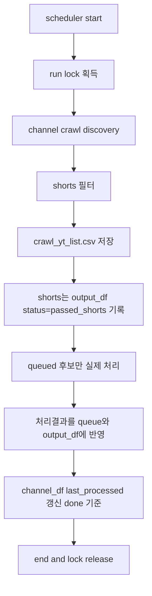

# 배치 주기 실행 (launchd)

`main.py`는 한 번 실행하면 url_list를 모두 처리한 뒤 종료합니다. **주기적으로** 채널 크롤·Whisper를 돌리려면 **launchd**로 N시간마다 `python main.py`를 실행하면 됩니다.  
`config.CHANNEL_BATCH_INTERVAL_HOURS`는 "몇 시간마다 실행할지" 참고용입니다 (예: 1=1시간마다, 24=하루마다).
실행 시작 시 run lock을 획득하므로, 이미 다른 배치가 돌고 있으면 신규 실행은 즉시 종료됩니다.

cron을 쓰는 방법은 문서 맨 뒤 **Appendix. cron**에 따로 적어 두었습니다.

**launchd를 쓸 때:** **현재 cron 세팅이 되어 있으면 끄세요.** launchd와 cron이 둘 다 돌면 중복·lock 충돌이 납니다. 끄는 방법은 맨 뒤 "Use case별 터미널 명령" 참고.

---

## 1. launchd vs batch.py (권장: launchd)

두 가지 방식이 있습니다.

| 구분 | (1) launchd로 N시간마다 main.py 실행 | (2) batch.py를 백그라운드로 두고, N시간마다 main.py 호출 |
|------|--------------------------------------|--------------------------------------------------------|
| **동작** | 매 주기마다 **새 프로세스**로 `main.py` 실행 → 끝나면 **종료** | **한 프로세스**가 계속 떠 있고, sleep(N시간) 후 `main.py` 실행(subprocess 등) 반복 |
| **RAM** | 실행 중에만 main.py·Whisper 등 사용, **끝나면 전부 해제**. 주기 사이에는 이 앱이 쓰는 RAM 0 | main 실행 중 RAM 사용은 동일. **대기 중에도** Python 인터프리터·batch.py 프로세스가 상주 (수십 MB 수준) |
| **디스크** | 동일 (로그·output 등) | 동일 + batch.py 코드 유지 |
| **안정성** | 한 번 실행이 크래시해도 다음 주기에 **새 프로세스**로 다시 시도. OS가 매번 새로 띄움 | batch.py가 크래시하면 **재시작 전까지** 아무 실행 없음. 재시작하려면 launchd/cron으로 batch.py를 다시 띄워야 함 |
| **유지보수** | plist만 관리. 코드 변경 없음 | batch.py + (선택) plist로 "batch.py 한 번 실행" 스케줄 필요 |

**추천: (1) launchd.**  
RAM·디스크를 아끼고, 채널 사이클을 아직 검토 중이라면 "주기만 OS에 맡기고, 한 번 실행은 기존 main.py 그대로"가 단순합니다.  
(2)는 "주기 안에 복잡한 조건·재시도·네트워크 체크" 등을 한 프로세스 안에서 하고 싶을 때 고려하면 됩니다.

**launchd 실행 시 CHANNEL_CRAWL=false면 실행하지 않음:**  
plist에서 `LAUNCHD_SCHEDULED=1` 환경변수를 넘기고, main.py는 이 변수가 있을 때 `CHANNEL_CRAWL=false`이면 곧바로 종료합니다. 그래서 스케줄은 채널 크롤용으로만 돌고, config에서 false로 바꿔도 launchd가 헷갈리지 않게 합니다.

**launchd가 로드된 상태에서 main.py 수동 실행 시 (이중 프로세스 방지):**  
main.py는 수동 실행 시 `launchctl list`로 해당 launchd 잡이 로드돼 있는지 확인합니다. 로드돼 있으면 경고를 남기고 **수동으로 켠 프로세스만 바로 종료**합니다. 따라서 스케줄이 돌아가는 도중에 수동으로 main.py를 켜서 두 프로세스가 동시에 돌는 상황(5번)을 피할 수 있습니다. input_df·채널 크롤 모두 **수동으로 돌리려면 먼저 launchd를 unload** 한 뒤 main.py를 실행하면 됩니다.

**plist가 한 번 돌 때 처리하는 것:**  
채널 크롤(스케줄 시각 배치) URL + **input_df.csv에 있는 URL**을 같이 처리합니다. (CHANNEL_CRAWL=true일 때 채널 후보와 input_df를 병합해 실행.)

**conda 환경:**  
- 터미널에서 **launchctl 명령**(bootout, bootstrap, kickstart)은 conda base/ai 구분 없이 아무 환경에서나 실행해도 됨.  
- **실제 스케줄에 main.py가 실행될 때**는 래퍼 스크립트가 **`.../envs/ai/bin/python`** 으로 `exec` 하므로 **항상 conda ai 환경**에서 실행됨.

---

## 2. launchd 설정 (macOS)

macOS에서는 **launchd**를 쓰는 편이 좋습니다. 로그인 후에도 동작하고, 재부팅 후 자동으로 다시 올라옵니다.

### plist 위치 (Developer/PJT)

- **경로:** `~/Developer/PJT/launchd/com.user.p03-speech2text.plist`
- **설치:** `scripts/install_launchd.sh` (래퍼 → Application Support, plist 하드 링크, bootstrap)
- **환경:** `WORK_PATH` = 프로젝트 루트, `TMPDIR`/`XDG_CACHE_HOME` = `{WORK_PATH}/tmp`, `{WORK_PATH}/cache`, `DATA_ROOT` = `{WORK_PATH}/data` (`.env`)
- **yt-dlp:** 주기적으로 `ai` 환경에서 업데이트 권장:  
  `/opt/homebrew/Caskroom/miniforge/base/envs/ai/bin/python -m pip install -U yt-dlp`
- **자막 Errno 11 완화:** `stt_function_v3`에서 자막 재시도 전에 해당 `video_id`의 `.part`/`.tmp`/0바이트 vtt·srt를 `yt_subs`에서 삭제 후 재시도.
- **WORK_PATH / DATA_ROOT:** plist의 `WORK_PATH`를 바꾸면 `TMPDIR`·`XDG_CACHE_HOME` 경로도 같은 루트로 맞춘 뒤 `bootout`→`bootstrap`.
- **md_relocate:** plist 해제·제거됨. STT는 저장 시 날짜 폴더(`YYYY_MM_DD/`)에 직접 저장. [OBSIDIAN_MD_RELOCATE.md](OBSIDIAN_MD_RELOCATE.md) 참고.

plist를 수정한 뒤에는 `launchctl bootout` → `launchctl bootstrap` 로 다시 등록하면 됩니다.

### launchd plist 점검 체크리스트 (Errno 11 / 자막 완화)

| 키 | 기대 예시 | 비고 |
|----|-----------|------|
| `WorkingDirectory` | `p03_speech2text` 프로젝트 루트 | 코드는 여기서 실행 |
| `WORK_PATH` | 프로젝트 루트 (`$PROJECT_ROOT`) | `audio/`, `yt_subs/`, `data/`, `tmp/`, `cache/`, `index/` |
| `TMPDIR` | `{WORK_PATH}/tmp` | launchd는 login 셸이 아니므로 **명시 권장** |
| `XDG_CACHE_HOME` | `{WORK_PATH}/cache` | yt-dlp 등 캐시 |
| `ProgramArguments` | **`~/Library/Application Support/.../run-p03-speech2text.sh`** 한 개만 (래퍼가 conda `ai`의 `python main.py`로 `exec`) | 인터프리터 경로 바뀌면 **래퍼 파일** 수정 후 `cp`로 배포 |

`WORK_PATH`를 바꾸면 `TMPDIR`·`XDG_CACHE_HOME` 경로도 같은 루트로 맞춘 뒤 `bootout` → `bootstrap`. 상세 Errno 11 대응: [ICLOUD_ERRNO11_FIX.md](ICLOUD_ERRNO11_FIX.md) 섹션 6.

### DATA_ROOT → iCloud 미러 (retired 2026-07)

통합 레이아웃 이후 **비활성**. `com.user.p03-data-mirror-icloud` plist는 bootout 후 제거.  
스크립트 `mirror_data_root_to_icloud.py`는 `P03_DISABLE_ICLOUD_MIRROR=0` 일 때만 수동 실행.

상세: [MIGRATION_20260711.md](MIGRATION_20260711.md)

### 로드·시작·중지

아래는 터미널에 그대로 복붙해서 쓸 수 있는 명령만 적어 둔 것입니다. 필요한 것만 순서대로 실행하면 됩니다.

**1. LaunchAgents에 plist 연결 (install_launchd.sh 권장)**

```
cd $PROJECT_ROOT && ./scripts/install_launchd.sh
```

수동 하드 링크:

```
rm -f ~/Library/LaunchAgents/com.user.p03-speech2text.plist
ln ~/Developer/PJT/launchd/com.user.p03-speech2text.plist ~/Library/LaunchAgents/com.user.p03-speech2text.plist
```

**2. 등록 (스케줄 시작)**

```
launchctl bootstrap gui/$(id -u) ~/Library/LaunchAgents/com.user.p03-speech2text.plist
```

**3. 지금 한 번 강제 실행 (테스트/수동 트리거)**

```
launchctl kickstart -k gui/$(id -u)/com.user.p03-speech2text
```

`-k`는 이미 실행 중이어도 한 번 더 돌리라는 뜻. 3시/9시가 안 돌아갔을 때 수동으로 한 번 돌릴 때 사용.

**4. 중지 (다음 주기까지 실행 안 함)**

```
launchctl stop gui/$(id -u)/com.user.p03-speech2text
```

**5. 해제 (스케줄 제거)**

```
launchctl bootout gui/$(id -u) ~/Library/LaunchAgents/com.user.p03-speech2text.plist
```

**5-1. Bootstrap failed: 5 (Input/output error) 나올 때**

`launchctl bootstrap` 실행 시 **같은 Label의 잡이 이미 로드돼 있으면** 이 오류가 납니다. 같은 plist를 두 번 등록할 수 없기 때문입니다.

1. **이미 로드됐는지 확인**
   ```bash
   launchctl list | grep p03-speech2text
   ```
   `com.user.p03-speech2text`가 보이면 로드된 상태입니다.

2. **해제 후 다시 등록**
   ```bash
   launchctl bootout gui/$(id -u) ~/Library/LaunchAgents/com.user.p03-speech2text.plist
   launchctl bootstrap gui/$(id -u) ~/Library/LaunchAgents/com.user.p03-speech2text.plist
   ```

3. **그래도 실패하면**
   - **plist 링크:** `ls -li` 로 LaunchAgents 항목과 Code 쪽 plist의 **inode가 같은지**(하드 링크) 또는 심볼릭 링크가 깨지지 않았는지 확인.
   - **plist 문법:** `plutil -lint ~/Library/LaunchAgents/com.user.p03-speech2text.plist`
   - **디렉터리:** `mkdir -p ~/Library/Logs/p03-speech2text` 및 `mkdir -p ~/Library/Application Support/com.user.p03-speech2text` — 래퍼는 Code에서 `cp` 해 두었는지 확인 ([`launchd/README.md`](../../../../launchd/README.md)).
   - **`78 EX_CONFIG`:** [LAUNCHD.md](LAUNCHD.md) 의 해당 절 — Documents 아래 스크립트만 실행하거나, 예전 `p03_speech2text/logs/launchd_*.log` 에 `macl`이 붙은 채 plist가 가리키는 경우 등.

**6. 지금 돌고 있는 실행만 멈추기**

스케줄은 그대로 두고, **이번에 백그라운드에서 돌고 있는 main.py만** 종료할 때 사용합니다. 아래 한 줄 복붙하면 됩니다.

```
pkill -f "p03_speech2text.*main.py"
```

(PID를 확인할 때: `ps aux | grep "p03_speech2text.*main.py"` 결과에서 **맨 위 줄**의 두 번째 숫자가 main.py의 PID입니다. 아래에 나오는 `grep ... main.py` 줄은 명령어 자신이므로 건너뛰고, 그 PID로 `kill <PID>` 하면 됩니다.)

**로그로 진행 상황 보기**

launchd는 백그라운드에서 돌기 때문에 터미널 창에 아무것도 안 뜹니다. 대신 **로그가 실시간으로 파일에 쌓이므로, 로그를 보면 진행 상황을 확인할 수 있습니다.**

- **로그 파일 위치**
  - 표준 출력: **`~/Library/Logs/p03-speech2text/launchd_stdout.log`**
  - 표준 에러: **`~/Library/Logs/p03-speech2text/launchd_stderr.log`**
  - 앱 로그(날짜별): `p03_speech2text/logs/stt_YYYYMMDD.log` (변경 없음)
  - (선택) 래퍼 진단: `p03_speech2text/logs/launchd_wrapper.log`
- **새 사이클이 시작되면 같은 파일에 이어 쓰입니다.** 매 사이클별로 따로 저장해 둘 필요 없습니다.
- **실시간으로 보려면** (아래 한 줄 복붙)

```
tail -f ~/Library/Logs/p03-speech2text/launchd_stdout.log
```

`~/Library/Logs/p03-speech2text/` 는 미리 `mkdir -p` 해 두세요.

**주의:** plist에는 `PATH` 환경변수가 포함되어 있어야 합니다 (ffmpeg 등 도구를 찾기 위해). plist의 `EnvironmentVariables`에 `/opt/homebrew/bin`이 PATH에 포함되어 있는지 확인하세요.

### plist 값 참고

- **StartCalendarInterval**: 여러 dict 배열로 하루 중 여러 시각 지정 (현재 plist: 3·9·15시).
- **RunAtLoad**: `true`면 LaunchAgent 로드 시 한 번 실행(스케줄 보조).
- **Python(conda ai 환경)**: plist에 python을 직접 넣지 않고, **래퍼 스크립트**가 `exec …/envs/ai/bin/python main.py` 를 수행합니다. 인터프리터 경로가 바뀌면 `run-p03-speech2text.sh` 를 고친 뒤 `~/Library/Application Support/...` 로 `cp` 배포.
- **PATH 환경변수**: launchd는 기본 PATH만 사용하므로, plist의 `EnvironmentVariables`에 `PATH=/opt/homebrew/bin:/usr/local/bin:/usr/bin:/bin:/usr/sbin:/sbin`을 추가해야 ffmpeg 등을 찾을 수 있음.
- plist·운영 상세는 Code 폴더 [`launchd/README.md`](../../../../launchd/README.md) 및 [LAUNCHD.md](LAUNCHD.md) 참고.

---

## 3. 정리

| 방법      | 주기 설정                    | 특징 |
|-----------|-----------------------------|------|
| launchd   | `StartCalendarInterval` 등  | macOS 기본, 재부팅 후에도 유지, 권장 |
| cron      | crontab `분 시 일 월 요일`  | 설정 간단, 절전 시 미실행 가능 (Appendix 참고) |

`CHANNEL_BATCH_INTERVAL_HOURS`(config.py)와 **실제 실행 주기**를 맞추어 두면, "N시간마다 한 번 배치"로 동작합니다.

---

## 4. 트러블슈팅: "로그가 안 뜨고 멈춘 것처럼 보임"

다음 상황은 실제 멈춤이 아니라 채널 크롤 준비 단계 지연일 수 있습니다.

- **증상**
  - `Loaded output dataframe ...` 이후 한동안 콘솔에 추가 로그가 거의 없음
- **원인 후보**
  - `channel_df.csv`의 `@handle`을 channel_id로 해석하는 네트워크 호출이 채널 수만큼 누적됨
  - 로그가 main 모듈에만 보이고 channel_crawl 모듈 로그가 콘솔에 전달되지 않는 설정
- **현재 코드 동작**
  - channel_crawl 진행 로그(`[i/N]`, `resolving handle`, 채널별 fetch/accepted 건수)를 출력
  - 루트 로거 사용으로 channel_crawl 로그도 터미널에 표시
  - handle 해석 timeout 단축(지연 체감 완화)

### 확인 포인트

```bash
# 메인 로그(날짜별)
tail -f $PROJECT_ROOT/logs/stt_$(date +%Y%m%d).log

# launchd 사용 시 표준 출력/에러 (plist가 가리키는 경로)
tail -f ~/Library/Logs/p03-speech2text/launchd_stdout.log
tail -f ~/Library/Logs/p03-speech2text/launchd_stderr.log
```

위 로그에서 `channel_crawl: parsing channel row [x/N]`, `channel_crawl: resolving handle @...`가 보이면 정상 진행 중입니다.

---

## 5. 중복 실행 방지(lock) 동작

- 실행 소스 분류:
  - `LAUNCHD_SCHEDULED=1` 또는 `CRON_SCHEDULED=1` -> scheduled
  - 그 외 -> manual
- 이미 실행 중인 작업이 있으면 신규 실행은 종료됩니다.
- 필수 메시지:
  - scheduled 실행 중에 manual `CHANNEL_CRAWL=false` 실행 시: `cron 작업 실행 중`
  - manual `CHANNEL_CRAWL=false` 실행 중에 scheduled 실행 시: `매뉴얼 df 작업 실행 중`

---

## 6. 채널 크롤 큐 처리 순서(요약)



---

## Appendix. cron

launchd 대신 **cron**으로 주기 실행할 때 참고용입니다. **이미 launchd로 돌리고 있다면 cron은 쓰지 말고**, 위에서 안내한 대로 기존 cron 설정이 있으면 `crontab -e`로 제거하세요. 터미널에서 `crontab -e`로 편집합니다.

**형식:** `분 시 일 월 요일 명령`

**기본: 3시간마다 (0시, 3시, 6시, …) — 백그라운드, 로그만 파일에**

- `0 */3 * * * cd $PROJECT_ROOT && CRON_SCHEDULED=1 /usr/bin/python3 main.py >> logs/cron.log 2>&1`
- 실행 시 새 터미널 창은 뜨지 않고, 출력은 `logs/cron.log`에만 쌓입니다. 실행 중인지 보려면 `ps aux | grep main.py` 또는 `tail -f logs/cron.log`로 확인하세요.

**선택: 3시간마다 — 실행 시 터미널 창 띄우기**

- cron이 돌 때마다 **새 Terminal 창**이 열리고, 그 안에서 `main.py`가 실행되어 로그를 눈으로 볼 수 있습니다.
- 예 (경로는 필요 시 수정):
  ```bash
  0 */3 * * * osascript -e 'tell application "Terminal" to do script "cd $PROJECT_ROOT && CRON_SCHEDULED=1 /usr/bin/python3 main.py; echo \"\" ; echo \"종료됨. 창 닫으려면 Enter\" ; read"'
  ```
- iTerm을 쓰면 `Terminal`을 `iTerm`으로 바꿀 수 있습니다.

**다른 주기 예시**

- **매시 정각** (1시간마다):  
  `0 * * * * cd $PROJECT_ROOT && CRON_SCHEDULED=1 /usr/bin/python3 main.py >> logs/cron.log 2>&1`
- **하루 한 번** (매일 02:00):  
  `0 2 * * * cd $PROJECT_ROOT && CRON_SCHEDULED=1 /usr/bin/python3 main.py >> logs/cron.log 2>&1`

`logs/` 디렉터리가 있으면 `cron.log`에 출력이 남습니다.

**주의:** cron은 로그인 세션과 무관하게 돌지만, macOS에서 "배터리/절전" 설정에 따라 실행이 제한될 수 있습니다. 맥이 잠자기 상태면 실행이 안 될 수 있으므로, **항상 켜 두는 서버처럼 쓰려면 launchd가 더 적합**합니다.

---

## Use case별 터미널 명령

아래는 **무슨 때에 Terminal에 뭘 입력하면 되는지**만 정리한 것입니다. 경로는 `p03_speech2text` 기준입니다.

| 하고 싶은 것 | 입력할 명령 |
|-------------|-------------|
| **input_df만 한 번 돌리기** (채널 크롤 없이) | `cd $PROJECT_ROOT && python main.py` (config에서 `CHANNEL_CRAWL=false`인 상태에서) |
| **채널 크롤 포함 한 번 수동 실행** | 먼저 launchd 해제(아래 "launchd 끄기"), 그다음 `cd $PROJECT_ROOT && python main.py` |
| **launchd 켜기** (스케줄 자동 실행 시작) | `launchctl bootstrap gui/$(id -u) ~/Library/LaunchAgents/com.user.p03-speech2text.plist` (최초 1회: plist **하드 링크**·래퍼 `cp` 등, 위 "로드·시작·중지"·[`launchd/README.md`](../../../../launchd/README.md) 참고) |
| **launchd 끄기** (스케줄 해제) | `launchctl bootout gui/$(id -u)/com.user.p03-speech2text` |
| **launchd 지금 한 번만 테스트 실행** | `launchctl kickstart -k gui/$(id -u)/com.user.p03-speech2text` |
| **launchd 중지** (다음 주기까지 실행 안 함, 나중에 다시 켜려면 kickstart 또는 bootstrap) | `launchctl stop gui/$(id -u)/com.user.p03-speech2text` |
| **cron 세팅 끄기** (launchd 쓸 때 cron이 있으면 끄기) | `crontab -e` → p03_speech2text/main.py 관련 줄 삭제하거나 맨 앞에 `#` 붙여서 저장 후 종료 |
| **지금 돌고 있는 실행만 멈추기** (백그라운드 프로세스 종료) | `pkill -f "p03_speech2text.*main.py"` |
| **실행 중인지 확인** | `ps aux \| grep main.py` 또는 `tail -f ~/Library/Logs/p03-speech2text/launchd_stdout.log` |
| **md_relocate** (레거시 flat 파일 일회성 이동) | `python md_relocate.py --dry-run` / `python md_relocate.py` (plist 해제됨, 저장은 날짜 폴더에 직접) |
