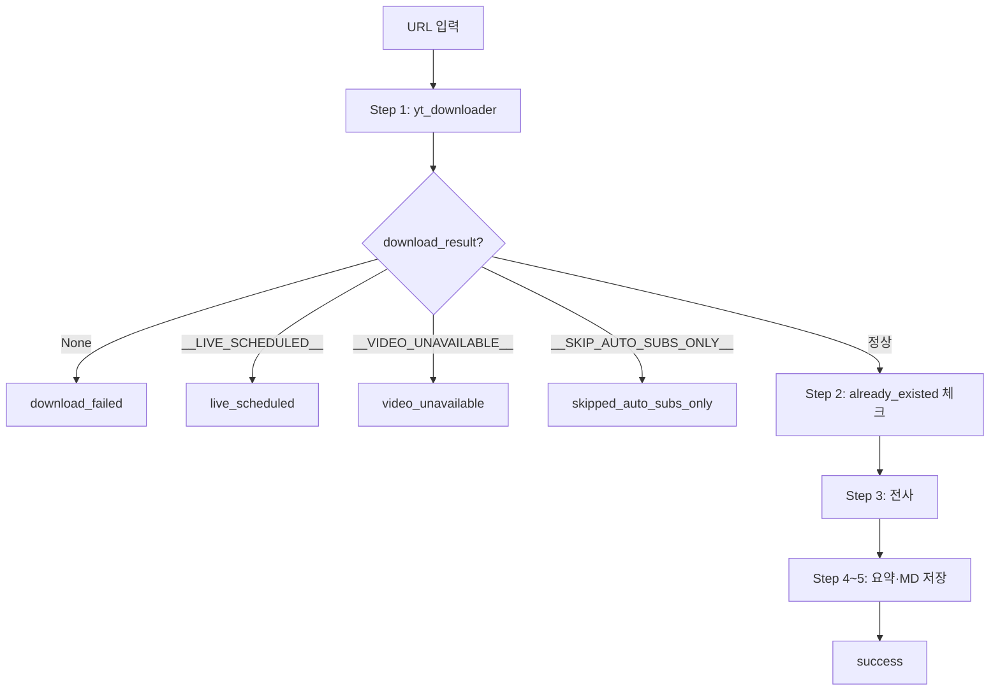

# Skip 로직 정교화 및 Plist 스케줄 변경 기획서

## 1. 배경 및 문제

### 1.1 현상
- 채널별로 **skip 되는 영상이 예상보다 많음**
- Skip 대상이 **예외 케이스**(스트리밍 예정, 멤버 전용)에 한정되어야 함
- 그 외 영상은 **전사 가능하면 전사**해야 함

### 1.2 Plist 스케줄
- **현재**: 오전 9시 1회만 실행
- **요청**: 오전 3시, 오전 9시 2회 실행

---

## 2. 현재 전사 분기 처리 흐름

### 2.1 전체 흐름 (process_single_video)



### 2.2 Skip 발생 위치 및 조건

| Status | 발생 위치 | 조건 |
|--------|----------|------|
| **live_scheduled** | stt_function_v3.yt_downloader_ytdlp | yt-dlp DownloadError 메시지에 `"live event"` 또는 `"this live event will begin"` 포함 |
| **video_unavailable** | stt_function_v3.yt_downloader_ytdlp | yt-dlp DownloadError 메시지에 `"Private video"` 또는 `"Video unavailable"` 포함 |
| **skipped_auto_subs_only** | stt_function_v3.yt_downloader_ytdlp | `auto_subs_only` 채널이고 `info.subtitles`·`info.automatic_captions` 둘 다 없음 (extract_info 단계) |
| **download_failed** | main.process_single_video | yt_downloader가 `None` 반환 (재시도 3회 후 실패) |

### 2.3 현재 Skip되지 않는 케이스 (download_failed로 처리)

| yt-dlp 에러 메시지 | 현재 처리 | 의도 |
|-------------------|----------|------|
| `This video is available to this channel's members on level: ...` | 3회 재시도 후 `None` → download_failed | **멤버 전용** → Skip 대상이어야 함 |
| `Video unavailable` | video_unavailable (Skip) | 유지 |
| `Private video` | video_unavailable (Skip) | 유지 |
| `This live event will begin...` | live_scheduled (Skip) | 유지 |
| 기타 (429, 403, 네트워크 등) | download_failed | 재시도 후 실패 |

---

## 3. 문제점 분석

### 3.1 멤버 전용 영상
- **현재**: `"members on level"` 에러 → 재시도 3회 → `None` → **download_failed**
- **문제**: 구독자 전용 영상은 접근 불가이므로 재시도 무의미. Skip으로 명시 처리하는 것이 맞음.
- **개선**: 에러 메시지에 `"members"` 또는 `"member"` 포함 시 `__VIDEO_UNAVAILABLE__`(또는 `__MEMBER_ONLY__`) 반환하여 즉시 Skip.

### 3.2 live_scheduled 판별 — **의도치 않은 Skip의 핵심 원인**

#### 3.2.1 라이브 종료 직후 영상이 "못 긁어오는" 이유 (예상)

**사용자 시나리오**: "라이브는 2시간 전에 종료됐는데, YouTube 상에서는 '스트리밍 3시간 전' 메시지가 보이는 영상"

| 단계 | 원인 | 결과 |
|------|------|------|
| **1. 라이브 종료 직후** | YouTube가 VOD 변환·처리 중 (transcoding, Content ID 등) | VOD 아직 미공개 |
| **2. 처리 중 상태** | `live_status` = `"post_live"` (처리 중) 또는 `"was_live"` | yt-dlp가 download 시도 |
| **3. download 실패** | YouTube가 `"This live event will begin in a few moments"` 같은 **오해의 소지 있는 에러** 반환 | 현재 코드: **live_scheduled로 Skip** |
| **4. YouTube UI** | "스트리밍 3시간 전" 등 **처리 중/캐시 상태** 표시 | 사용자가 실제로는 종료된 영상인데 왜 못 가져오나 의문 |

**핵심**: `"This live event will begin in a few moments"`는 **스트리밍 예정**뿐 아니라 **라이브 종료 후 VOD 처리 중**인 영상에서도 발생할 수 있음. 이 경우 Skip하면 안 되고, 재시도(다음 배치)에 맡겨야 함.

#### 3.2.2 live_status 값별 의미 (yt-dlp)

| live_status | 의미 | Skip 여부 |
|-------------|------|----------|
| `is_upcoming` | 스트리밍 예정 (아직 시작 안 함) | **Skip** |
| `is_live` | 라이브 중 (VOD 없음) | **Skip** |
| `post_live` | 라이브 종료, VOD 처리 중 | **Skip 금지** |
| `was_live` | 라이브 종료, VOD 공개됨 | **Skip 금지** |
| `not_live` | 일반 업로드 | **Skip 금지** |

#### 3.2.3 현재 로직의 문제
- **현재**: DownloadError 메시지에 `"live event"` 또는 `"this live event will begin"` 포함 시 **무조건 Skip**
- **문제**: `post_live` / `was_live` 영상에서도 동일한 에러가 나면 **잘못된 Skip** 발생
- **개선**: `extract_info`의 `live_status`를 **우선** 사용.  
  - `live_status in ("is_upcoming", "is_live")` → 사전 Skip (download 시도 없음)  
  - `live_status in ("was_live", "post_live", "not_live")` 또는 None → **Skip하지 않음**. download 실패 시 `"live event"` 에러가 나더라도 **download_failed**로 처리 (재시도·다음 배치에서 재시도)

### 3.3 skipped_auto_subs_only
- **조건**: `auto_subs_only` 채널 + 자막/자동자막 없음
- **의도치 않은 Skip 가능성**: 
  - `info.subtitles` / `info.automatic_captions`가 API 응답에 없거나 비어 있는 경우 (일시적 오류, 지역 제한 등) → 실제로는 자막이 있을 수 있음
- **현재**: extract_info 기준으로만 판단. 다운로드 시도 전 Skip.
- **개선 옵션**: 
  - (A) 유지: extract_info가 정확하다고 가정
  - (B) 자막 다운로드 1회 시도 후 실패 시에만 Skip (추가 요청 발생)

### 3.4 video_unavailable 범위
- **현재**: `"Private video"`, `"Video unavailable"` 만 매칭
- **추가 고려**: `"members on level"`, `"Sign in to confirm your age"` (연령 제한) 등 → Skip 후보

---

## 4. 목표 Skip 조건 (정교화)

### 4.1 Skip해야 하는 예외 케이스 (의도적 Skip)

| 케이스 | 판별 방법 | Status |
|--------|----------|--------|
| 스트리밍 예정 (upcoming) | `info.live_status == "is_upcoming"` 또는 에러 메시지 | live_scheduled |
| 라이브 중 (VOD 없음) | `info.live_status == "is_live"` 또는 에러 메시지 | live_scheduled |
| 멤버 전용 | 에러 메시지 `"members"` / `"member"` 포함 | video_unavailable (또는 member_only) |
| 비공개/삭제 | `"Private video"`, `"Video unavailable"` | video_unavailable |
| auto_subs_only + 자막 없음 | extract_info에서 subtitles·automatic_captions 없음 | skipped_auto_subs_only |

### 4.2 Skip하면 안 되는 케이스 (전사 시도)

| 케이스 | 현재 문제 | 개선 |
|--------|----------|------|
| 멤버 전용 | download_failed (3회 재시도 낭비) | 즉시 Skip으로 전환 |
| 일시적 오류 (429, 403, 네트워크) | download_failed | 유지 (재시도 후 실패) |
| 자막 있으나 다운로드 실패 | subs 실패 시 audio로 fallback | 현재 로직 유지 |

---

## 5. 구현 계획

### 5.1 stt_function_v3.py: yt_downloader_ytdlp 수정

#### 5.1.1 extract_info 단계에서 live_status 사전 판별
- `info = ydl.extract_info(URL, download=False)` 직후:
  - `live_status in ("is_upcoming", "is_live")` → `__LIVE_SCHEDULED__` 반환 (download 시도 없음)
  - `live_status in ("was_live", "post_live", "not_live")` 또는 None → download 시도 (Skip 금지)

#### 5.1.2 DownloadError 처리 시 live_scheduled 조건 강화
- **중요**: `"live event"` / `"this live event will begin"` 에러는 **live_status를 확인한 뒤에만** Skip.
- `info`(extract_info 결과)에서 `live_status`가 `"was_live"`, `"post_live"`, `"not_live"`이거나 없으면 → **live_scheduled로 Skip하지 않음**. `None` 반환하여 download_failed 처리 (다음 배치에서 재시도).
- `live_status in ("is_upcoming", "is_live")`인데 download 단계에서 에러가 난 경우에만 → `__LIVE_SCHEDULED__` 반환.

#### 5.1.3 DownloadError 처리 시 멤버 전용 추가
- 기존: `"Private video"`, `"Video unavailable"` → `__VIDEO_UNAVAILABLE__`
- 추가: `"members" in error_msg.lower()` 및 `"level" in error_msg.lower()` 등 → `__VIDEO_UNAVAILABLE__` 반환

#### 5.1.4 에러 메시지 매칭 정리 (live_status 반영)
```python
# Skip (즉시, 재시도 없음) — live_status 확인 필수
live_status = (info or {}).get("live_status") or ""
if "live event" in err or "this live event will begin" in err:
    # was_live, post_live, not_live이면 Skip 금지 (VOD 처리 중일 수 있음)
    if live_status not in ("was_live", "post_live", "not_live"):
        return __LIVE_SCHEDULED__
    # else: download_failed로 fall through (재시도 가능)
if "private video" in err or "video unavailable" in err:
    return __VIDEO_UNAVAILABLE__
if "members" in err.lower() and ("level" in err.lower() or "only" in err.lower()):
    return __VIDEO_UNAVAILABLE__  # 멤버 전용
```

### 5.2 main.py
- 변경 없음 (이미 `__LIVE_SCHEDULED__`, `__VIDEO_UNAVAILABLE__` 처리됨)

### 5.3 channel_crawl.py
- `apply_result_to_queue`: `video_unavailable`는 이미 done 처리. member_only를 별도 status로 둘 경우 추가.

### 5.4 Plist 스케줄 변경

**파일**: `Documents/Code/launchd/com.user.p03-speech2text.plist`

**현재**: `StartCalendarInterval` 1개 (Hour=9, Minute=0)

**변경**: launchd에서 **여러 시각** 실행하려면 `StartCalendarInterval`를 **배열**로 여러 개 지정.

```xml
<key>StartCalendarInterval</key>
<array>
    <dict>
        <key>Hour</key><integer>3</integer>
        <key>Minute</key><integer>0</integer>
    </dict>
    <dict>
        <key>Hour</key><integer>9</integer>
        <key>Minute</key><integer>0</integer>
    </dict>
</array>
```

**참고**: plist 수정 후 `launchctl bootout` → `launchctl bootstrap` 재등록 필요.

---

## 6. 수정 파일 요약

| 파일 | 변경 내용 |
|------|----------|
| stt_function_v3.py | extract_info 후 live_status 사전 Skip; DownloadError에 멤버 전용 매칭 추가; live event 에러 시 was_live/post_live면 Skip 금지 |
| launchd/com.user.p03-speech2text.plist | `StartCalendarInterval` 조정·실행/로그 경로 변경 — [LAUNCHD.md](LAUNCHD.md) |
| docs/SCHEDULING.md | launchd 스케줄·로그 경로 문서화 |

**구현 완료 (2026-01)**

---

## 7. 검증 포인트

1. **live_scheduled**: `live_status` 사전 판별 시 download 호출 없이 Skip되는지
2. **post_live / was_live**: `"This live event will begin"` 에러가 나도 `live_status`가 `was_live`/`post_live`이면 Skip하지 않고 `download_failed` → 다음 배치 (3시/9시)에서 재시도
3. **멤버 전용**: `"members on level"` 에러 시 즉시 `video_unavailable` 반환, 재시도 없음
4. **Plist**: 3시·9시에 각각 실행되는지 로그로 확인
5. **기존 동작**: `video_unavailable`, `skipped_auto_subs_only`, `download_failed` 등 다른 status 영향 없음

---

## 8. 향후 검토 (선택)

- **skipped_auto_subs_only**: extract_info에 자막 정보가 없을 때, 자막 다운로드 1회 시도 후 실패 시에만 Skip할지 (추가 API 호출)
- **연령 제한** (`Sign in to confirm your age`): Skip 대상 추가 여부
- **member_only** 별도 status: `video_unavailable`와 구분해 통계·리포트에 활용할지
